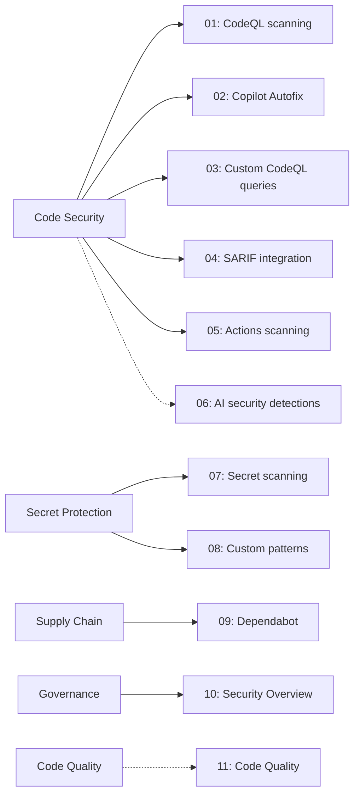

# ghas-demos


> ⚠️ **WARNING — INTENTIONALLY VULNERABLE REPOSITORY** ⚠️
>
> This repository contains **intentionally vulnerable code**, **fake/canary credentials**, and **known-vulnerable dependencies** for educational purposes.
>
> ❌ **Do not deploy this code.**
> ❌ **Do not reuse any of it in production.**
> ❌ **Do not paste real secrets into this repo, even to "test" the scanners.**
>
> ✅ Every finding here demonstrates GitHub's integrated security capabilities, including [**GitHub Code Security** and **GitHub Secret Protection**](https://docs.github.com/en/code-security/getting-started/github-security-features) — that is the entire point.

---

[](https://codespaces.new/tkl-enteprises/ghas-demos?quickstart=1)


*The repo's `Security and quality` tab — every lesson below ladders up to a number on this page.*

---

## Table of contents

- [What are GitHub Code Security and GitHub Secret Protection?](#what-are-github-code-security-and-github-secret-protection)
- [Workshop format](#workshop-format)
- [Workshop pillars at a glance](#workshop-pillars-at-a-glance)
- [Lessons](#lessons)
- [Prerequisites](#prerequisites)
- [Quick start](#quick-start)
- [Where to look in GitHub UI](#where-to-look-in-github-ui)
- [License](#license)
- [Disclaimer](#disclaimer)

## Quick start

**Option A — Codespaces (recommended for workshop attendees):**
[Open this repo in a Codespace](https://codespaces.new/tkl-enteprises/ghas-demos?quickstart=1) — the dev container pre-installs Python, the `gh` CLI, and the lesson dependencies. You can be running lesson 01 in under 60 seconds.

**Option B — Local clone:**
```bash
git clone https://github.com/tkl-enteprises/ghas-demos.git && cd ghas-demos
```
That's it for the source-review and UI lessons: no local package installation is required. Lesson 09 (Dependabot) is *intentionally* a list of vulnerable old pins in `lessons/09-supply-chain-dependabot/requirements.txt` — those packages won't install on Python 3.11 on purpose, and that's the demo (you don't need them locally; Dependabot scans the manifest from GitHub). Lesson 04's workflow installs Bandit for its SARIF exercise; lessons 05 and 06 use inert text/source fixtures that must not be executed or deployed.

## What are GitHub Code Security and GitHub Secret Protection?

[GitHub Advanced Security capabilities are sold as two products](https://docs.github.com/en/code-security/getting-started/github-security-features): **GitHub Code Security** helps find and fix vulnerabilities with code scanning, Copilot Autofix, dependency review, and premium Dependabot capabilities; **GitHub Secret Protection** detects exposed credentials with secret scanning and blocks new leaks with push protection. GitHub also provides core supply-chain features, including Dependabot alerts and security updates, across GitHub plans. The goal of this workshop is to make these capabilities fire on a small, friendly Python codebase so attendees can see, with their own eyes, what shows up where.

## Workshop format

- **9 core lessons + 2 optional preview lessons**, each in its own folder under [`lessons/`](lessons/).
- **Self-contained** — every lesson has its own `README.md` with goal, steps, and where to look in the GitHub UI.
- **Runnable in any order** — there are no cross-lesson dependencies. Pick the pillar your audience cares about and start there.
- **Python-first and source-review safe** — the core app examples are Python 3; lessons 05 and 06 add inert workflow and multi-language fixtures. No Docker build, Terraform apply, or cloud deployment is required.

## Workshop pillars at a glance

The five pillars below define the workshop order. Lesson folders use the exact two-digit `[number]-[pillar]-[lesson]` convention; for example, `04-code-security-sarif-integration` is lesson 04 in the `code-security` pillar.



> The dashed arrows mark optional public-preview material. **Code Quality is its own pillar and is distinct from Code Security**: it uses CodeQL infrastructure with maintainability and reliability queries instead of security queries. GitHub documents general availability for July 20, 2026. During preview, scans consume GitHub Actions minutes but active-committer and AI-credit usage is not billed; [GA introduces additional usage charges](https://docs.github.com/en/billing/concepts/product-billing/github-code-quality). **AI-powered security detections** remain in the Code Security pillar because they complement CodeQL with advisory, pull-request-only security findings. They require a separately configured repository that uses CodeQL default setup. See [lesson 06](lessons/06-code-security-ai-detections/) and [lesson 11](lessons/11-code-quality-analysis/).

## Lessons

Lessons are grouped in pillar order: Code Security (01–06), Secret Protection (07–08), Supply Chain (09), Governance (10), and Code Quality (11). SARIF integration and AI-powered security detections are Code Security lessons; Code Quality is not.

| # | Pillar | Lesson | Folder |
| - | ------ | ------ | ------ |
| 01 | Code Security | CodeQL Code Scanning | [`lessons/01-code-security-codeql-scanning/`](lessons/01-code-security-codeql-scanning/) |
| 02 | Code Security | Copilot Autofix | [`lessons/02-code-security-copilot-autofix/`](lessons/02-code-security-copilot-autofix/) |
| 03 | Code Security | Custom CodeQL Queries | [`lessons/03-code-security-custom-codeql-queries/`](lessons/03-code-security-custom-codeql-queries/) |
| 04 | Code Security | SARIF / 3rd-party Tool Integration | [`lessons/04-code-security-sarif-integration/`](lessons/04-code-security-sarif-integration/) |
| 05 | Code Security | CodeQL for GitHub Actions | [`lessons/05-code-security-actions/`](lessons/05-code-security-actions/) |
| 06 | Code Security | AI-powered security detections (optional / public preview) | [`lessons/06-code-security-ai-detections/`](lessons/06-code-security-ai-detections/) |
| 07 | Secret Protection | Secret Scanning + Push Protection | [`lessons/07-secret-protection-secret-scanning/`](lessons/07-secret-protection-secret-scanning/) |
| 08 | Secret Protection | Custom Secret Patterns | [`lessons/08-secret-protection-custom-patterns/`](lessons/08-secret-protection-custom-patterns/) |
| 09 | Supply Chain | Dependabot / Supply Chain (+ Malware bonus) | [`lessons/09-supply-chain-dependabot/`](lessons/09-supply-chain-dependabot/) |
| 10 | Governance | Security Overview (Org-level Governance) | [`lessons/10-governance-security-overview/`](lessons/10-governance-security-overview/) |
| 11 | Code Quality | Code Quality — same engine, different queries (bonus / public preview) | [`lessons/11-code-quality-analysis/`](lessons/11-code-quality-analysis/) |

## Prerequisites

- A **GitHub Team or GitHub Enterprise Cloud organization**. Private or internal workshop repositories need access to **GitHub Code Security** and **GitHub Secret Protection**; many demonstrated capabilities are available free for public repositories. This repo lives under [`tkl-enteprises`](https://github.com/tkl-enteprises).
- **Python 3.11+** on the workstation following along.
- Optional: the [**CodeQL CLI**](https://docs.github.com/en/code-security/codeql-cli) for lesson 3 (custom queries) if you want to iterate locally.
- Optional: the [**`gh` CLI**](https://cli.github.com/) for cloning and triggering workflows from the terminal.

## Where to look in GitHub UI

Most of the demo value lives in the GitHub UI, not in the source code. Bookmark these:

- **`Security and quality → Code scanning`** → [https://github.com/tkl-enteprises/ghas-demos/security/code-scanning](https://github.com/tkl-enteprises/ghas-demos/security/code-scanning)
- **`Security and quality → Secret scanning`** → [https://github.com/tkl-enteprises/ghas-demos/security/secret-scanning](https://github.com/tkl-enteprises/ghas-demos/security/secret-scanning)
- **`Security and quality → Dependabot`** → [https://github.com/tkl-enteprises/ghas-demos/security/dependabot](https://github.com/tkl-enteprises/ghas-demos/security/dependabot)
- **`Org → Security overview`** → [https://github.com/orgs/tkl-enteprises/security/overview](https://github.com/orgs/tkl-enteprises/security/overview)

## License

[MIT](LICENSE) — do whatever you want with the workshop materials, but please don't ship the vulnerable code.

## Disclaimer

This repository is **not affiliated with Microsoft or GitHub**. All opinions are the author's own. The code, configurations, and credentials in this repository are **intentionally vulnerable** and exist solely to demonstrate [GitHub Code Security, GitHub Secret Protection, and related GitHub security capabilities](https://docs.github.com/en/code-security/getting-started/github-security-features). **Do not use any of this in production.** If a scanner flags it, that's the feature working — not a bug.
