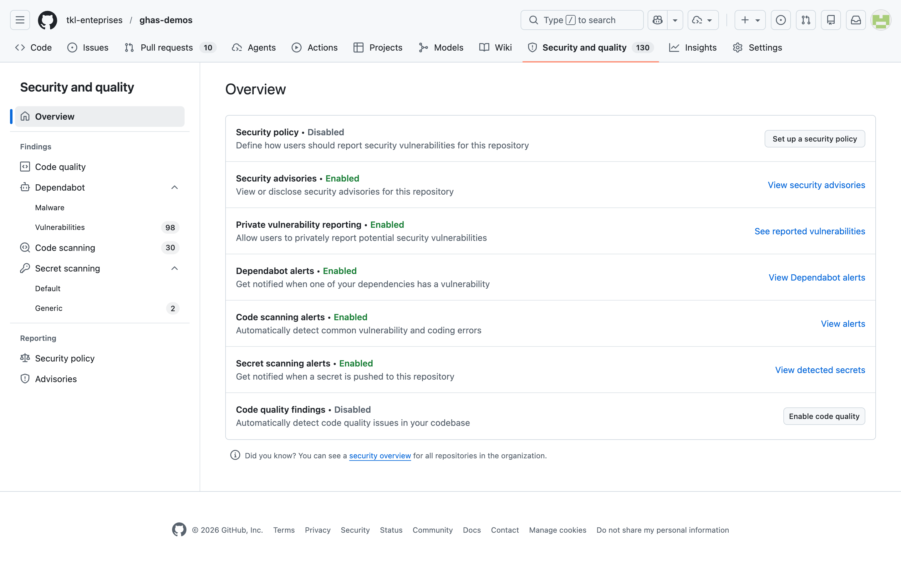
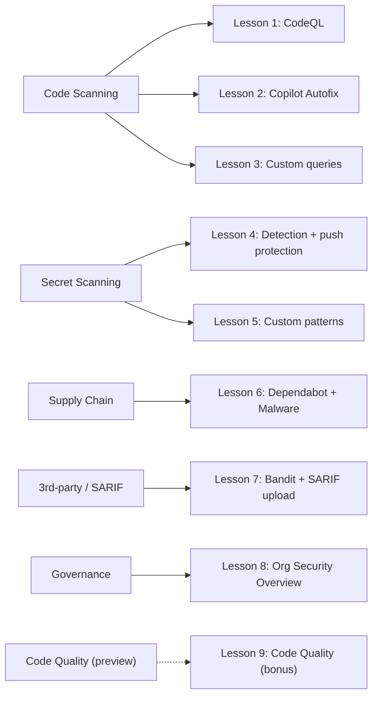

# ghas-demos


> ⚠️ **WARNING — INTENTIONALLY VULNERABLE REPOSITORY** ⚠️
>
> This repository contains **intentionally vulnerable code**, **fake/canary credentials**, and **known-vulnerable dependencies** for educational purposes.
>
> ❌ **Do not deploy this code.**
> ❌ **Do not reuse any of it in production.**
> ❌ **Do not paste real secrets into this repo, even to "test" the scanners.**
>
> ✅ Every finding here is **detected by [GitHub Advanced Security (GHAS)](https://docs.github.com/en/code-security/getting-started/github-security-features)** — that is the entire point.

---

[](https://codespaces.new/tkl-enteprises/ghas-demos?quickstart=1)



*The repo's `Security` tab — every lesson below ladders up to a number on this page._

---

## Table of contents

- [What is GHAS?](#what-is-ghas)
- [Workshop format](#workshop-format)
- [GHAS pillars at a glance](#ghas-pillars-at-a-glance)
- [Lessons](#lessons)
- [Prerequisites](#prerequisites)
- [Quick start](#quick-start)
- [Where to look in GitHub UI](#where-to-look-in-github-ui)
- [License](#license)
- [Disclaimer](#disclaimer)

## Quick start

**Option A — Codespaces (recommended for workshop attendees):**
[Open this repo in a Codespace](https://codespaces.new/tkl-enteprises/ghas-demos?quickstart=1) — the dev container pre-installs Python, the `gh` CLI, and the lesson dependencies. You can be running lesson 01 in under 60 seconds.

**Option B — Local clone:**
```bash
git clone https://github.com/tkl-enteprises/ghas-demos.git && cd ghas-demos
```
That's it — lessons 01, 02, 03, 04, 05, 07, 08 are stdlib-only and don't need `pip install`. Lesson 06 (Dependabot) is *intentionally* a list of vulnerable old pins in `lessons/06-dependabot-supply-chain/requirements.txt` — those packages won't install on Python 3.11 on purpose, and that's the demo (you don't need them locally; Dependabot scans the manifest from GitHub).

## What is GHAS?

[GitHub Advanced Security](https://docs.github.com/en/code-security/getting-started/github-security-features) (GHAS) is GitHub's native application security suite. It bundles **CodeQL code scanning**, **secret scanning with push protection**, **Dependabot supply chain alerts**, **Copilot Autofix**, and **org-level security overview / governance** into the same UI your developers already use for code review. The goal of this workshop is to make every one of those features fire on a small, friendly Python codebase so attendees can see, with their own eyes, what shows up where.

## Workshop format

- **8 core lessons + 1 bonus**, each in its own folder under [`lessons/`](lessons/).
- **Self-contained** — every lesson has its own `README.md` with goal, steps, and where to look in the GitHub UI.
- **Runnable in any order** — there are no cross-lesson dependencies. Pick the pillar your audience cares about and start there.
- **Python-only** — every code sample is plain Python 3. No build tools, no Docker, no cloud accounts required.

## GHAS pillars at a glance

The five pillars below are the mental model attendees should leave with — every lesson in the next section maps to one (or more) of them.



> The dashed arrow is **Code Quality** — a sibling product to GHAS that runs on the same CodeQL infrastructure, but with a maintainability/code-smell query pack instead of security queries. It's a *Preview* feature, billed separately as Action minutes. We've enabled it on this repo so attendees can see "the same engine finds different things" — see [lesson 9](lessons/09-code-quality/) for the full walkthrough.

## Lessons

Lessons are grouped by GHAS pillar — Code Scanning (1–3), Secret Scanning (4–5), Supply Chain (6), 3rd-party / SARIF (7), Governance (8), and a Code Quality bonus (9).

| # | Pillar | Lesson | Folder |
| - | ------ | ------ | ------ |
| 1 | Code Scanning   | CodeQL Code Scanning | [`lessons/01-codeql-code-scanning/`](lessons/01-codeql-code-scanning/) |
| 2 | Code Scanning   | Copilot Autofix | [`lessons/02-copilot-autofix/`](lessons/02-copilot-autofix/) |
| 3 | Code Scanning   | Custom CodeQL Queries | [`lessons/03-custom-codeql-queries/`](lessons/03-custom-codeql-queries/) |
| 4 | Secret Scanning | Secret Scanning + Push Protection | [`lessons/04-secret-scanning/`](lessons/04-secret-scanning/) |
| 5 | Secret Scanning | Custom Secret Patterns | [`lessons/05-custom-secret-patterns/`](lessons/05-custom-secret-patterns/) |
| 6 | Supply Chain    | Dependabot / Supply Chain (+ Malware bonus) | [`lessons/06-dependabot-supply-chain/`](lessons/06-dependabot-supply-chain/) |
| 7 | 3rd-party / SARIF | SARIF / 3rd-party Tool Integration | [`lessons/07-sarif-integration/`](lessons/07-sarif-integration/) |
| 8 | Governance      | Security Overview (Org-level Governance) | [`lessons/08-security-overview/`](lessons/08-security-overview/) |
| 9 | Code Quality (bonus / preview) | Code Quality — same engine, different queries | [`lessons/09-code-quality/`](lessons/09-code-quality/) |

## Prerequisites

- A **GitHub Enterprise organization with GHAS enabled** (this repo lives under [`tkl-enteprises`](https://github.com/tkl-enteprises), which has GHAS).
- **Python 3.11+** on the workstation following along.
- Optional: the [**CodeQL CLI**](https://docs.github.com/en/code-security/codeql-cli) for lesson 3 (custom queries) if you want to iterate locally.
- Optional: the [**`gh` CLI**](https://cli.github.com/) for cloning and triggering workflows from the terminal.

## Where to look in GitHub UI

Most of the demo value lives in the GitHub UI, not in the source code. Bookmark these:

- **`Security → Code scanning`** → [https://github.com/tkl-enteprises/ghas-demos/security/code-scanning](https://github.com/tkl-enteprises/ghas-demos/security/code-scanning)
- **`Security → Secret scanning`** → [https://github.com/tkl-enteprises/ghas-demos/security/secret-scanning](https://github.com/tkl-enteprises/ghas-demos/security/secret-scanning)
- **`Security → Dependabot`** → [https://github.com/tkl-enteprises/ghas-demos/security/dependabot](https://github.com/tkl-enteprises/ghas-demos/security/dependabot)
- **`Org → Security overview`** → [https://github.com/orgs/tkl-enteprises/security/overview](https://github.com/orgs/tkl-enteprises/security/overview)

## License

[MIT](LICENSE) — do whatever you want with the workshop materials, but please don't ship the vulnerable code.

## Disclaimer

This repository is **not affiliated with Microsoft or GitHub**. All opinions are the author's own. The code, configurations, and credentials in this repository are **intentionally vulnerable** and exist solely to demonstrate detection capabilities of [GitHub Advanced Security](https://docs.github.com/en/code-security/getting-started/github-security-features). **Do not use any of this in production.** If a scanner flags it, that's the feature working — not a bug.
