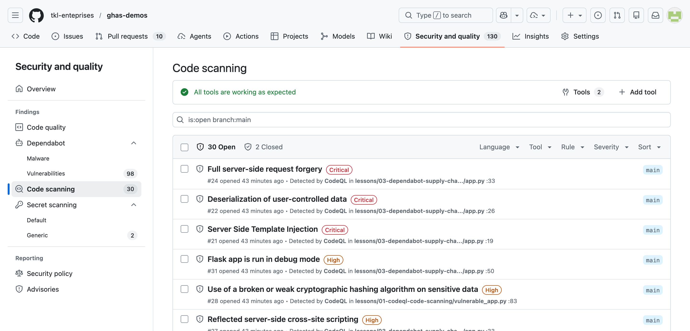

# Lesson 01 — CodeQL Code Scanning

See your first batch of CodeQL alerts on intentionally vulnerable Python code, and learn to read the data-flow paths CodeQL produces.

## Goal

By the end of this lesson you will be able to:

- Recognise the CodeQL **Code Scanning** workflow run on a pull request.
- Open the **Security → Code scanning** view in this repository.
- Read a CodeQL alert: rule id, severity, source → sink data-flow path.
- Map an alert back to the line of code that introduced it.

## Learning objectives

After this lesson you can:

- Trigger CodeQL by pushing to a branch or opening a PR.
- Filter alerts by **Tool**, **rule id**, and **severity** in the Security tab.
- Walk through a source → sink data-flow path inside an alert.
- Compare a default-suite alert against a custom-query alert (lesson 03).

## Estimated time

**~15 min demo + 5 min discussion**

## Prerequisites

- GHAS enabled on the repo with the `CodeQL` workflow configured (default or workflow-based setup).
- The CodeQL workflow has run at least once on `main` — check the **Actions** tab.
- `scripts/preflight.sh` passed for the workshop run.

## What you'll see in GitHub

After CodeQL runs against this lesson, expect alerts similar to the table below in [Security → Code scanning](https://github.com/tkl-enteprises/ghas-demos/security/code-scanning). Exact line numbers shift as the files evolve — match by **rule id**, not line number.

| Rule id (CodeQL) | CWE | Severity | Where to look |
| --- | --- | --- | --- |
| `py/sql-injection` | CWE-89 | High / Critical | `vulnerable_app.py` → `lookup_user`, `user_routes.py` → `search_users`, `list_user_orders` |
| `py/command-line-injection` | CWE-78 | High / Critical | `vulnerable_app.py` → `ping_host` |
| `py/path-injection` | CWE-22 | High | `vulnerable_app.py` → `read_report` |
| `py/code-injection` | CWE-94 | Critical | `vulnerable_app.py` → `evaluate_expression` |
| `py/clear-text-logging-sensitive-data` | CWE-312 | Medium / High | `vulnerable_app.py` → `log_login_attempt` |
| `py/weak-cryptographic-algorithm` | CWE-327 | Medium | `vulnerable_app.py` → `hash_password` |
| `py/hardcoded-credentials` | CWE-798 | High | `vulnerable_app.py` → `ADMIN_PASSWORD` |

> 💡 You should see between 7 and ~10 alerts depending on whether CodeQL splits some sinks into multiple findings. That is normal.



*`Security → Code scanning` for this repo. Filter by **Tool: CodeQL** to reproduce this view._

## Hands-on steps

1. **View the files in this folder.** Open `vulnerable_app.py` and `user_routes.py` and skim the comments above each function — every block names the CodeQL rule it triggers.
2. **Trigger a scan.** Either push these files to a fork of [`tkl-enteprises/ghas-demos`](https://github.com/tkl-enteprises/ghas-demos) or open a pull request that touches them. The `CodeQL` workflow runs automatically on push and PR.
3. **Wait for the workflow to complete.** Visit the **Actions** tab and watch the `CodeQL` job. It takes a few minutes the first time. Then open **Security → Code scanning**.
4. **Inspect each alert.** Click an alert (e.g. *SQL query built from user-controlled sources*). Note three things:
   - The **rule id** (top-right) — this is what you grep for in CodeQL docs.
   - The **data-flow path** — CodeQL highlights `request.args[...]` as the *source* and `cursor.execute(...)` as the *sink*. Click "Show paths" to step through every hop.
   - The **severity** and **security-severity** scores — used by branch-protection rules.
5. **Try Copilot Autofix.** On any alert, click **Generate fix** to see Autofix propose a patch. We dive deeper into Autofix in [lesson 02](../02-copilot-autofix/README.md).

![Detail page for a CodeQL Server-Side Template Injection alert with the dataflow path expanded — source highlighted at `request.args[...]`, sink at the template render call, with every intermediate hop listed.](../../docs/screenshots/02-codeql-alert-detail.png)

*Alert detail with **Show paths** expanded. The source → sink path is the artefact unique to dataflow analysis — it's what separates CodeQL from regex-based linters._

## Files in this lesson

| File | Purpose |
| --- | --- |
| `vulnerable_app.py` | One function per CWE — the "alert sampler" file. |
| `user_routes.py` | Flask-style route handlers with two SQL-injection sinks; demonstrates per-endpoint detection. |
| `solution.md` | Manual remediation for every vulnerability. |
| `README.md` | This file. |

## Discussion prompts

Use these to drive the workshop conversation after attendees have explored the alerts:

1. **Severity vs exploitability.** Two alerts share the same `security-severity` score but very different real-world impact (e.g. `py/sql-injection` in `lookup_user` vs `py/weak-cryptographic-algorithm`). How would you decide which to fix first in your own backlog?
2. **Source vs sink.** CodeQL's path view shows where untrusted input enters the program and where it reaches a dangerous API. Which side is usually easier to harden, and why? When does *sanitisation at the boundary* fall short?
3. **Default suite vs security-extended.** This repo runs the **default** Python query suite. Browse [the security-extended pack](https://codeql.github.com/codeql-query-help/python/) — pick one query that is *not* in the default suite and discuss whether your team would accept its noise budget.

## Exit criteria

The demo has landed when:

- Attendees can find the SQL-injection alert in the Security tab without prompting.
- Attendees articulate, in their own words, what the source → sink path means.
- Attendees can name at least one rule id from the table above.

## Key takeaways

- CodeQL is **dataflow-aware** — it traces user input from source to sink, not just regex matches on dangerous APIs.
- **Default setup** is one-click but the **advanced (workflow-based) setup** is required for custom queries (see lesson 03).
- The same alert UI hosts CodeQL, third-party SARIF (lesson 07), and Copilot Autofix (lesson 02) — one triage surface.

## Reset state

This lesson does not mutate the repo. To reset for the next cohort:

```bash
git checkout main && git pull
```

CodeQL alerts auto-update on the next scheduled scan; no manual cleanup required.
