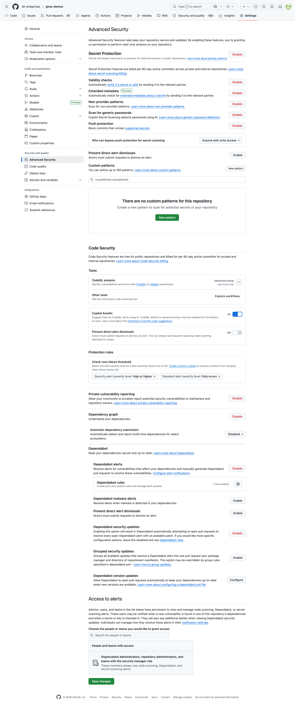

# Lesson 04 — Secret Scanning + Push Protection

See GitHub Advanced Security detect hard-coded credentials in source, block new ones at `git push`, and validate live tokens with partner providers.

## Goal

Experience secret scanning and push protection end-to-end. The **live demo** is push protection — push a fresh canary in a workshop branch and watch GitHub stop the push before it ever lands on the remote. The static files below document the credential **formats** GHAS recognizes.

## Learning objectives

After this lesson you can:

- Distinguish secret scanning (detection) from push protection (prevention).
- Trigger push protection by pushing a partner-pattern shaped value (e.g. an Azure storage connection string with a fresh `AccountKey=…`).
- Read a partner-pattern alert and check its **validity** badge.
- Bypass push protection with `secret-scanning.skip-push-protection=true` and explain when that's appropriate.

## Estimated time

**~10 min demo + 5 min discussion**

## Prerequisites

- GHAS + secret scanning + push protection enabled on the repo.
- Local clone with push access (the live demo writes a commit and tries `git push`).
- Preflight has confirmed push protection is currently enforcing — see the live capture note below before relying on the block.

## What's in this lesson

Four Python files plus a `.env.example`. Each Python file hard-codes a *fake* credential that matches a partner pattern — an Azure storage `AccountKey=…`, `sk_test_…`, `ghp_…` — but every value is clearly marked `FAKE` / `DEMO` so a human reader can tell at a glance there's no real credential committed.

| File | Format demonstrated |
| --- | --- |
| `config.py` | `Azure Storage Connection String` (FAKEDEMO-marked AccountKey) |
| `payment.py` | `Stripe API Key` (test key with `sk_test_` prefix) |
| `github_client.py` | `GitHub Personal Access Token` (`ghp_` prefix) |
| `.env.example` | **Nothing** — placeholders only. This teaches the right pattern. |

> ⚠️ Every file (except `.env.example`) starts with a "this is intentionally vulnerable" header. Do not copy these patterns into real code.

> 🎯 **Why Azure-first?** GHAS partner-pattern coverage spans 200+ providers (Azure, AWS, GCP, Stripe, Slack, OpenAI, Snowflake, …); secret scanning is vendor-neutral and the **same workshop runs unchanged for an AWS- or GCP-shop customer** — only the screenshots change. We've picked Azure as the headline fixture because the typical delivery audience for this material is a Microsoft-tenant team. If your audience is multi-cloud or AWS-first, lean on the [Stripe](payment.py) and [GitHub PAT](github_client.py) fixtures (also partner patterns) and frame Azure as "one example of a 200+ list".

## Why the alert tab might look empty before you start

Modern secret scanning combines regex match with **AI-powered suppression** of obvious test/example values, **provider denylists** (each provider publishes its own list of well-known canary keys), and **validity probing**. When the static files in this lesson contain words like `FAKE` or `DEMO`, GHAS may correctly suppress them as "obviously not a real leak" — that's the feature working as designed for the production case, not a bug.

This is exactly why the **live push-protection moment** is the heart of this lesson. When an attendee pushes a *new* line that looks like a credential, GHAS evaluates it without the benefit of seeing it's already-known-fake — and push protection fires.


*The **Default** tab is empty by design — the committed canaries are flagged-and-suppressed by AI heuristics. This is the suppression behaviour described above; it is not a misconfiguration._


*The **Generic** tab (AI-powered detection) is where committed-but-unrecognized credential shapes do surface. Useful to show alongside the Default tab to explain why one looks empty and the other doesn't._

## Push protection demo

Push protection runs **client-side at `git push` time** — GitHub refuses the push before the secret is written to the remote. Try it:



*Repo settings page showing push protection enabled. Confirm this checkbox is green before running the live demo — without it the push below will succeed silently._

1. Clone the repo locally.
   ```bash
   git clone https://github.com/tkl-enteprises/ghas-demos.git
   cd ghas-demos
   ```
2. Edit `lessons/04-secret-scanning/payment.py` and add a new line that *looks* like a real Azure storage connection string — anything matching the partner pattern (`AccountKey=<88-char base64>` inside a `DefaultEndpointsProtocol=…` block) will do. For example:
   ```python
   NEW_AZURE_KEY = (
       "DefaultEndpointsProtocol=https;AccountName=demo;"
       "AccountKey=PUSHBLOCKDEMOPUSHBLOCKDEMOPUSHBLOCKDEMOPUSHBLOCKDEMOPUSHBLOCKDEMOPUSHBLOCKDEMOPS==;"
       "EndpointSuffix=core.windows.net"
   )
   ```
3. Commit and try to push:
   ```bash
   git add lessons/04-secret-scanning/payment.py
   git commit -m "test push protection"
   git push
   ```
4. Observe push protection block the push with a remote rejection that links to the offending file/line and includes a bypass URL. See https://docs.github.com/en/code-security/secret-scanning/working-with-push-protection for the full workflow.

   > 📜 **Historical artifact — push-protection-block transcript.** The verbatim terminal capture below (and the full text in [`docs/screenshots/push-protection-block.txt`](../../docs/screenshots/push-protection-block.txt)) was recorded in May 2026 against the workshop's *previous* AWS-first fixtures (an `AKIA…`-shaped access-key pair). It documents a still-relevant gotcha — push protection silently ignored an admin push and returned `EXIT_CODE: 0` — but the AWS-shaped strings in the transcript do **not** match the current Azure-first fixtures in this lesson. We deliberately keep the historical evidence intact rather than re-recording: the *failure mode* is what matters (admin bypass list + validity-check deprioritisation), and re-recording would only change the surface key shape, not the diagnosis. See **FACILITATOR.md → Push protection bypass — mitigations for live demos** for the full root-cause analysis and the three mitigations.

   ```text
   # Push-protection live test — captured 2026-05-06 (UTC) — HISTORICAL ARTIFACT
   # The fixtures used below are the workshop's previous AWS-first canaries;
   # the lesson's current Azure-first fixture lives in config.py. The transcript
   # is preserved verbatim because the *failure mode* (admin push not blocked)
   # is what teaches the lesson — not the surface key shape.
   #
   # OBSERVED BEHAVIOR: push protection did NOT block this push.
   # The fresh canary committed was:
   #   TEST_AWS_KEY    = "AKIAQ7HYG3LZDFNV4P9X"   (20 chars, AKIA prefix)
   #   TEST_AWS_SECRET = "kMxR8JqLPmZbV5tNcW2yFhDgX7sQpA1RyZ4ePaT3"  (40 chars)
   #
   # These were placed adjacent in lessons/04-secret-scanning/canary-test.py
   # on branch test-push-protection-ephemeral and pushed. The push SUCCEEDED
   # (exit 0) — no GH013 secret-scanning rule violation was emitted from the
   # remote. The remote branch (and its canary) were deleted immediately
   # after capture.
   #
   # Verbatim push output follows (all stderr+stdout, no redaction):
   # ----------------------------------------------------------------
   remote:
   remote: Create a pull request for 'test-push-protection-ephemeral' on GitHub by visiting:
   remote:      https://github.com/tkl-enteprises/ghas-demos/pull/new/test-push-protection-ephemeral
   remote:
   remote: GitHub found 98 vulnerabilities on tkl-enteprises/ghas-demos's default branch (6 critical, 36 high, 46 moderate, 10 low). To find out more, visit:
   remote:      https://github.com/tkl-enteprises/ghas-demos/security/dependabot
   remote:
   To https://github.com/tkl-enteprises/ghas-demos.git
    * [new branch]      test-push-protection-ephemeral -> test-push-protection-ephemeral
   branch 'test-push-protection-ephemeral' set up to track 'origin/test-push-protection-ephemeral'.
   EXIT_CODE: 0
   ```

5. **Bypass workflow** (only if you genuinely need to land a documented test value, e.g. a test fixture):
   ```bash
   git push -o secret-scanning.skip-push-protection=true
   ```
   Each bypass requires a reason and is audited. In a real workflow, prefer "this is a false positive" via the UI so security can refine the pattern, or "used in tests" with a proper test fixture marker — and **never** "I'll rotate it later".

## Validity checks

For partners that support it (Azure, AWS, GCP, GitHub, Slack, Stripe, …) GHAS pings the issuer's API to check whether the leaked token is currently valid. The alerts in the security tab will be tagged `Active` or `Inactive`. The canary credentials in this lesson should all show as **inactive / unknown** — they were never live, by design. In a real leak, an `Active` tag means "rotate, *now*".

## AI detection

With AI-powered detection enabled at the org level, GHAS will also surface generic-looking secrets (passwords, tokens) that don't match any partner pattern. It uses an LLM to classify suspicious string assignments. In this lesson, the `password = "hunter2_FAKE_DEMO_PASSWORD"` pattern in `payment.py`'s comments is the kind of thing AI detection would flag (we don't actually hard-code that variable to keep partner detections clean).

## Where to look in GitHub

- Repo alerts: <https://github.com/tkl-enteprises/ghas-demos/security/secret-scanning>
- Push protection bypasses (audit log): org → Settings → Audit log → search for `secret_scanning_push_protection`.

## Hands-on steps

1. Open the repo's **Security → Secret scanning alerts** tab.
2. Confirm at least three alerts are present: Azure Storage connection string, Stripe test key (or generic API key), GitHub PAT.
3. Click into the Azure alert. Note: the file path, the line number, the validity badge, and the recommended remediation.
4. Clone the repo, follow the *Push protection demo* steps above to get a hard rejection.
5. Bypass the rejection with `-o secret-scanning.skip-push-protection=true`, then immediately revert/force-push to clean up your branch (so we don't leave canaries scattered around).
6. Open `solution.md` and walk through the remediation runbook.

## Discussion prompts

1. A teammate accidentally committed a **production** Azure storage connection string 30 minutes ago. Walk through your incident response — what's step 1, step 2, step 3?
2. When is bypassing push protection the right call, and when is it a smell? How do you tell the two apart in PR review?
3. What's the conceptual difference between secret scanning (detection on existing code) and push protection (prevention at push time)? Why do you need both?
4. Your customer is multi-cloud (Azure + AWS) — would you re-record this lesson with `AKIA…`-shaped fixtures, or argue that the Azure-shaped demo translates 1:1 to AWS partner-pattern coverage? What evidence would you bring to the conversation?

## Files

| File | Purpose |
| --- | --- |
| `README.md` | This lesson guide |
| `config.py` | Fake Azure storage connection string (`AccountKey=FAKEDEMO…==`) |
| `payment.py` | Fake Stripe `sk_test_FAKE_…` token |
| `github_client.py` | Fake GitHub `ghp_FAKE…` PAT |
| `.env.example` | The right way to share config — placeholders only, no values |
| `solution.md` | Remediation runbook |

## Exit criteria

The demo has landed when:

- The push of a fresh canary is blocked (or, if a regression, attendees can articulate why and pivot to the partner-pattern alert).
- Attendees locate the Azure / Stripe / GitHub PAT alerts on the **Default** or **Generic** tab.
- Attendees know the bypass syntax (`-o secret-scanning.skip-push-protection=true`) and when it's appropriate.

## Key takeaways

- **Push protection blocks at git-push time** — before the secret ever lands in remote storage. Detection-after-the-fact is too late for live credentials.
- **AI suppression** of FAKE / DEMO / EXAMPLE markers is a feature for production but means workshops need *non-obvious* test values to make the live demo fire.
- Every bypass is **logged and audited** — it leaves a trail in the org audit log.

## Reset state

```bash
git checkout main
git branch -D test-push-protection-ephemeral 2>/dev/null || true
git pull --rebase origin main
```

If a real bypass landed a commit during the demo, revert it via PR. If push-protection-skip branches got pushed, delete them with `git push origin --delete <branch>`.
