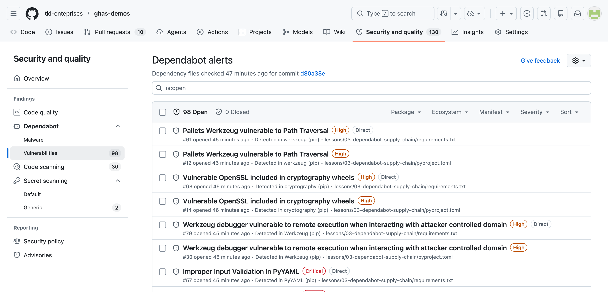

# Lesson 06 — Dependabot & Supply Chain Security

A Python project pinned to **intentionally vulnerable** dependencies so you can experience GitHub's supply-chain features end-to-end: dependency graph, Dependabot alerts, Dependabot security updates, and PR-time dependency review.

## Goal

Experience GitHub's supply-chain stack in a real repo:

- **Dependency graph** — GitHub parses `requirements.txt` / `pyproject.toml` and lists every direct + transitive package.
- **Dependabot alerts** — security advisories matched against that graph appear under **Security → Dependabot**.
- **Dependabot security updates** — automated PRs that bump vulnerable pins to safe versions.
- **Dependency review** — a PR check that blocks new vulnerable deps from sneaking in.

## Learning objectives

After this lesson you can:

- Read a Dependabot alert: advisory id, affected version range, fixed version, call-path link.
- Distinguish **Dependabot alerts** (signal) from **Dependabot security update PRs** (action).
- Trigger PR-time **dependency review** by adding a vulnerable dep on a PR.
- Articulate a triage strategy when the queue of Dependabot PRs grows non-trivially.

## Estimated time

**~10 min demo + 10 min discussion**

## Prerequisites

- GHAS + Dependabot alerts + Dependabot security updates enabled on the repo.
- `.github/dependabot.yml` and `.github/workflows/dependency-review.yml` exist (owned by the platform / devcontainer track).
- Dependency graph has parsed `requirements.txt` — confirm via **Insights → Dependency graph**.

## What's in this lesson

- `requirements.txt` — the canonical, pinned, intentionally-vulnerable dep list.
- `pyproject.toml` — PEP 621 mirror of the same deps for Poetry / build-system users.
- `app.py` — a tiny Flask app whose imports exercise each vulnerable package.
- `solution.md` — the operational guide (triage workflow, resolution paths, configuration tips).

> The repo-wide `.github/dependabot.yml` is configured (by the platform) to monitor this folder weekly for `pip` ecosystem updates. The repo-wide `.github/workflows/dependency-review.yml` runs on every pull request.

## Pinned vulnerabilities

Every line in `requirements.txt` maps to at least one published advisory in the GitHub Advisory Database. Dependabot will surface them under **Security → Dependabot alerts** once the dep graph processes the file.

| Package        | Version | Advisory                                                                      | Severity        | Impact summary                                                              |
|----------------|---------|-------------------------------------------------------------------------------|-----------------|-----------------------------------------------------------------------------|
| Flask          | 0.12.0  | `GHSA-5wv5-4vpf-pj6m`                                                         | Moderate        | Denial of service via crafted JSON input on the dev server.                 |
| Jinja2         | 2.10    | `GHSA-462w-v97r-4m45`                                                         | High            | Sandbox escape via `str.format` on user-controlled format strings.          |
| Werkzeug       | 0.14    | `GHSA-px8h-6qxv-m22q` and others (see Dependabot alert in repo)               | Moderate / High | Open redirect; debug-pin RCE on older versions; cookie parsing issues.      |
| urllib3        | 1.24.1  | `GHSA-mh33-7rrq-662w`                                                         | Moderate        | CRLF injection in request method allows header smuggling.                   |
| requests       | 2.19.1  | `GHSA-x84v-xcm2-53pg`                                                         | Moderate        | `Authorization` header leaked on cross-origin redirects.                    |
| PyYAML         | 5.1     | `CVE-2020-14343`                                                              | Critical        | Arbitrary code execution via `yaml.load` before 5.4.                        |
| cryptography   | 2.3     | `GHSA-hggm-jpg3-v476` and others (see Dependabot alert in repo)               | Variable        | RSA key generation issues; multiple subsequent advisories through 41.x.     |

> Advisory IDs are stable identifiers in the GitHub Advisory Database — search any of them at <https://github.com/advisories>.

## Visual reference



*The Dependabot alerts page after the dependency graph parses `requirements.txt` and `pyproject.toml`. Each row maps back to a published advisory in the GitHub Advisory Database._


*Dependabot opens one PR per fixable alert. These are the **security updates** — the auto-PRs that bump vulnerable pins to safe versions._


*A single security-update PR. Note the **CVE annotation**, **release notes pulled from the upstream repo**, and the **compatibility score** — Dependabot's signal that the bump is unlikely to break callers._

## Hands-on steps

1. **Inspect the pins.** Open `requirements.txt` in this folder and note that every dep is pinned with `==` to an old, known-vulnerable version.
2. **Open the Dependabot alerts page** — <https://github.com/tkl-enteprises/ghas-demos/security/dependabot>. You should see one or more alerts per package above. Click an alert to read the advisory, the affected version range, the fixed version, and the call path (when GitHub can resolve it).
3. **Open the dependency graph** — <https://github.com/tkl-enteprises/ghas-demos/network/dependencies>. Confirm GitHub picked up `requirements.txt` *and* `pyproject.toml`. Click into any dep to see its dependents and known vulnerabilities.
4. **Trigger PR-time dependency review.** Open a pull request that adds a new vulnerable package — for example, append `Pillow==8.0.0` to `requirements.txt`. The `dependency-review.yml` workflow (owned by the platform agent) will comment a risk summary on the PR and fail if your config disallows it.
5. **Watch for Dependabot security update PRs.** Dependabot will open one PR per fixable alert against the default branch. Review the diff, the release notes Dependabot includes, and the compatibility score. If you have admin rights and want to force a sweep without waiting for the schedule:
   ```bash
   gh api -X POST /repos/tkl-enteprises/ghas-demos/dependabot/security_updates
   ```
   (If the endpoint isn't enabled for your account, just wait — the schedule in `.github/dependabot.yml` runs weekly.)

## Dependency review on PRs

The companion workflow `.github/workflows/dependency-review.yml` (created by the platform agent) runs on every pull request to the default branch. It uses [`actions/dependency-review-action`](https://github.com/actions/dependency-review-action) to:

- Diff the dependency graph between the base and head of the PR.
- Block (or comment) when the diff introduces a package whose version matches a published advisory.
- Optionally fail on license violations.

This is **the** safety net that stops a contributor from re-introducing a vulnerable pin that Dependabot just removed.

## Auto-merging Dependabot PRs

For low-risk patch bumps you can auto-merge once CI is green. See:

<https://docs.github.com/en/code-security/dependabot/working-with-dependabot/automating-dependabot-with-github-actions>

A common pattern: a workflow that listens for `pull_request` events from `dependabot[bot]`, reads `dependabot/fetch-metadata`, and calls `gh pr merge --auto --squash` when `update-type` is `version-update:semver-patch`.

## Files

| File              | Purpose                                                          |
|-------------------|------------------------------------------------------------------|
| `requirements.txt`| Pinned, intentionally vulnerable dep list (the alert source).    |
| `pyproject.toml`  | PEP 621 mirror so Poetry / build-system tooling sees same graph. |
| `app.py`          | Tiny Flask app that imports each vulnerable package.             |
| `README.md`       | This walkthrough.                                                |
| `solution.md`     | Triage + resolution playbook for the workshop facilitator.       |

## Discussion prompts

1. How do you balance the urgency of a critical security update against the breaking-change risk of a major version bump (e.g. Flask 0.12 → 3.x)?
2. When is it acceptable to **dismiss** a Dependabot alert? What evidence should accompany an "ignore — not exploitable in our context" decision?
3. How does GitHub's dependency review compare to commercial SCA tools (Snyk, Mend, Sonatype)? Where does each shine, and where do they overlap?

## Exit criteria

The demo has landed when:

- Attendees can name two of the seven pinned advisories without looking at the table.
- Attendees see at least one Dependabot security update PR in the **Pull requests** tab.
- Attendees describe what dependency review does on a PR.

## Key takeaways

- **Alerts surface risk; PRs ship the fix.** Dependabot does both, but they're separate user-visible surfaces with separate review workflows.
- Dependency review is the **prevention** half — it stops a contributor from re-introducing a vulnerable pin that Dependabot just removed.
- Compatibility scores and release notes in the PR are the signal you use to choose *patch-bump auto-merge* vs *manual review*.

## Reset state

This lesson does not need a hard reset between cohorts — the pinned vulnerabilities stay deliberately old.

```bash
git checkout main && git pull
```

If you opened a "test dependency review" PR during the demo, close it without merging.
