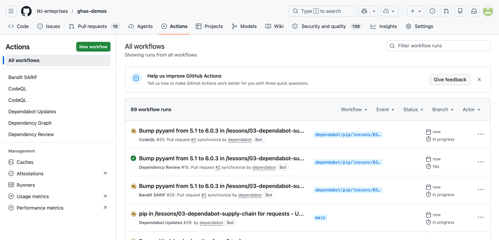
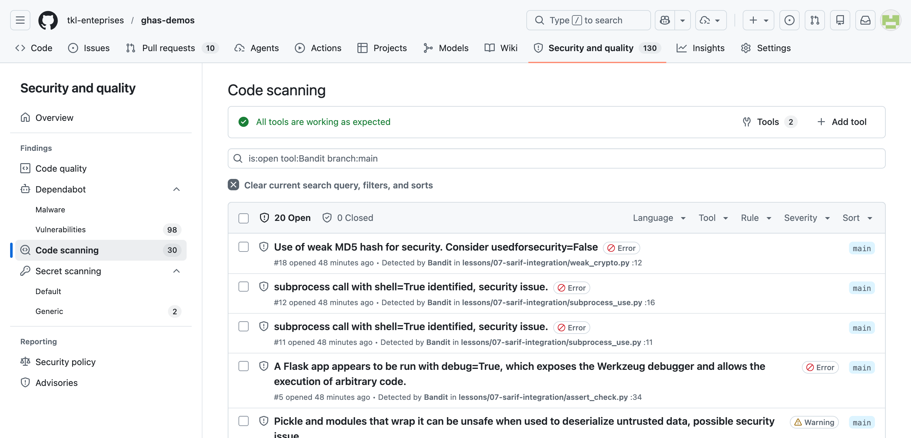

# Lesson 07 — SARIF & 3rd-party Tool Integration

Layer Bandit (and any other SARIF-emitting SAST tool) on top of CodeQL so every finding lands in one Code Scanning UI.

> 📌 `sample.sarif` in this folder is a **frozen example** of what Bandit emits — useful for inspecting SARIF structure without re-running CI. The actual `.github/workflows/sarif-bandit.yml` workflow uploads **fresh** SARIF on every push and PR.

## Goal

Show how to ingest 3rd-party SAST results into GitHub Code Scanning via SARIF, using Bandit (Python-focused security linter) as the example tool.

## Why use SARIF integration

GitHub Code Scanning is a **SARIF receiver**, not just a CodeQL frontend. Any tool that produces a [SARIF 2.1.0](https://docs.oasis-open.org/sarif/sarif/v2.1.0/) file — Bandit, Semgrep, Trivy, Checkov, Snyk, KICS, ESLint, gitleaks, you name it — can upload via `github/codeql-action/upload-sarif@v3` and findings appear alongside CodeQL results. That means triage, dismissals, autofix branches, and PR annotations all happen in one UI. Layer multiple scanners for breadth (Bandit catches Python footguns CodeQL deprioritises; Trivy catches container/IaC issues neither covers).

## Workflow

`.github/workflows/sarif-bandit.yml` (created by the github-config agent):

```yaml
- run: pip install bandit[sarif]
- run: bandit -r lessons/07-sarif-integration -f sarif -o bandit.sarif || true
- uses: github/codeql-action/upload-sarif@v3
  with:
    sarif_file: bandit.sarif
    category: bandit
```

Notes:
- `|| true` keeps the job green even when Bandit finds issues — Code Scanning surfaces severity, the workflow shouldn't fail the PR.
- `category: bandit` keeps these findings distinct from CodeQL's, so they don't overwrite each other.
- The `.github/codeql/codeql-config.yml` is configured with `paths-ignore: lessons/07-sarif-integration/**`, so CodeQL skips this folder entirely. Bandit owns it. No duplicate alerts.

## Hands-on steps

1. **Read each `.py` file in this folder.** Note the variety of issues — weak crypto, pickle, eval, subprocess, SQL injection, asserts-as-auth, hardcoded passwords. Some of these aren't CodeQL's strong suits (it has overlap on SQLi/eval, but Bandit's blacklist-based checks catch the long tail).
2. **Push a commit or open a PR.** The Bandit workflow runs automatically.
3. Visit **Security → Code scanning** on the repo. Filter by **Tool = Bandit**.
4. Compare a Bandit finding (e.g. MD5 use in `weak_crypto.py`) to a CodeQL finding from lesson 01. Notice both surface in the same UI, with the same dismiss / autofix UX.
5. Open `sample.sarif` in this folder and locate the matching `results[0]` entry. Cross-reference its `ruleId`, `locations[0].physicalLocation`, and `message.text` to understand SARIF structure.



*The Actions tab is the upstream of every screenshot below — green checkmarks on `CodeQL` and `Bandit (SARIF upload)` are what populates the Code Scanning view._



*Bandit findings surfaced in `Security → Code scanning` after `upload-sarif@v3` ran. Triage UI is identical to CodeQL's — same dismiss reasons, same alert lifecycle, same PR annotations._

## SARIF schema cheat sheet

A SARIF 2.1.0 document is a JSON tree. The four parts you'll touch most:

| Path | What it is |
|------|------------|
| `runs[].tool.driver.name` | Display name in Code Scanning ("Bandit", "Semgrep", "Trivy"). |
| `runs[].results[].ruleId` | Rule identifier (e.g. `B303`). Used for grouping/filtering. |
| `runs[].results[].locations[].physicalLocation` | File `uri` + `region` (startLine / startColumn / endLine / endColumn). |
| `runs[].results[].partialFingerprints` | Stable hash so re-uploads don't create duplicate alerts. |

References:
- SARIF 2.1.0 spec — https://docs.oasis-open.org/sarif/sarif/v2.1.0/
- GitHub's SARIF support docs — https://docs.github.com/en/code-security/code-scanning/integrating-with-code-scanning/sarif-support-for-code-scanning

## Other tools you can integrate

Any tool that emits SARIF can upload via `github/codeql-action/upload-sarif@v3`. Common picks:

- **Semgrep** — `returntocorp/semgrep-action` (rules across many languages, great for custom org policies)
- **Trivy** — `aquasecurity/trivy-action` (container images, IaC, filesystem, dependencies)
- **Checkov** — `bridgecrewio/checkov-action` (Terraform / CloudFormation / Kubernetes IaC)
- **Snyk** — `snyk/actions/python@master` (SCA + container, requires Snyk token)
- **KICS** — `checkmarx/kics-github-action` (IaC scanner from Checkmarx)
- **gitleaks** — `gitleaks/gitleaks-action` (secret detection, complements GHAS Secret Scanning)

Pattern is always the same: run the tool with `--sarif` / `-f sarif` output, then `upload-sarif` with a unique `category:`.

## Where to look

After the workflow runs, filter Code Scanning to just the Bandit findings:

👉 https://github.com/tkl-enteprises/ghas-demos/security/code-scanning?tool=bandit

## Files

| File | Purpose | Bandit rules |
|------|---------|--------------|
| `weak_crypto.py` | MD5 + `random` for security | B303, B311 |
| `unsafe_deserialize.py` | `pickle.loads` on untrusted bytes | B301 |
| `eval_use.py` | `eval` / `exec` on input | B307 |
| `subprocess_use.py` | `subprocess.Popen(..., shell=True)` | B404, B602, B603 |
| `sql_format.py` | SQL via `%`-format and f-string | B608 |
| `assert_check.py` | `assert` for auth + hardcoded password + Flask `debug=True` | B101, B105, B107, B201 |
| `sample.sarif` | Frozen example of Bandit's SARIF output | — |
| `solution.md` | Fixes + multi-tool strategy | — |

## Discussion prompts

1. **When would you choose Bandit over CodeQL** (or vice versa) for a given repo or rule family?
2. **How do you de-duplicate findings across tools** when Bandit and CodeQL both flag the same line?
3. **Should every team adopt every SAST tool**, or is it better to pick one strong scanner per language and invest in custom rules?
