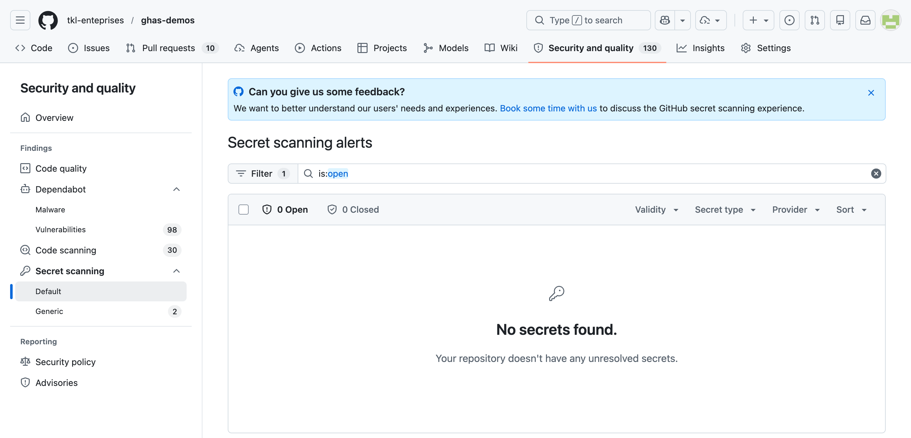
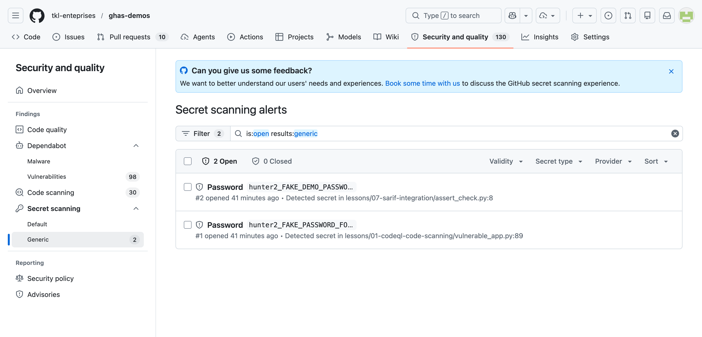

# Lesson 07 — Secret Scanning + Push Protection

See GitHub Secret Protection detect hard-coded credentials in source, block new ones before they reach GitHub, and validate supported partner tokens.

## Goal

Experience secret scanning and push protection end-to-end. The **live demo** is push protection — push a fresh canary in a workshop branch and watch GitHub stop the push before it ever lands on the remote. The static files below document the credential **formats** GHAS recognizes.

## Learning objectives

After this lesson you can:

- Distinguish secret scanning (detection) from push protection (prevention).
- Trigger push protection by pushing a partner-pattern shaped value (e.g. an Azure storage connection string with a fresh `AccountKey=…`).
- Read a partner-pattern alert and check its **validity** badge.
- Explain AI-detected generic secrets and how they differ from regex-based generic and partner patterns.
- Route a push-protection exception through delegated bypass instead of letting every contributor self-approve.
- Describe public monitoring and push protection for GitHub MCP server writes without overstating their coverage.

## Estimated time

**~10 min demo + 5 min discussion**

## Prerequisites

- An organization-owned repository on **GitHub Team or GitHub Enterprise Cloud** with **GitHub Secret Protection** (or a legacy GitHub Advanced Security entitlement), with secret scanning and repository push protection enabled. Secret scanning and user push protection also have free coverage for public repositories on GitHub.com, but the governance exercises below require Secret Protection.
- Local clone with push access (the live demo writes a commit and tries `git push`).
- Preflight has confirmed push protection is currently enforcing — see the live capture note below before relying on the block.
- For the AI exercise, an enterprise owner must allow generic secret detection (allowed by default), and the repository or applied security configuration must enable **Scan for AI-detected secrets**.

## Feature status and licensing

| Capability | Current status | Requirement / important limit |
| --- | --- | --- |
| AI-detected generic secrets | **Generally available** | Organization- or enterprise-owned repository with GitHub Secret Protection. **No GitHub Copilot subscription is required.** The current AI detector covers passwords, reports them in a separate AI-detected list, and does not provide push protection or validity checks for those password findings. |
| Delegated bypass for push protection | **Generally available** | Organization-owned repository on GitHub Team or GitHub Enterprise Cloud with GitHub Secret Protection and repository push protection enabled. |
| Public monitoring | **Public preview**; subject to change | GitHub Enterprise Cloud with GitHub Advanced Security or GitHub Secret Protection. **Unavailable on GitHub Enterprise Cloud with data residency (`GHE.com`).** |
| Push protection for GitHub MCP server interactions | **Generally available** | Documented for writes to **public repositories only**. Do not claim private/internal MCP coverage; normal repository and REST/CLI coverage has different requirements. |

Product names and availability change over time. Recheck the linked GitHub documentation before a customer delivery.

## What's in this lesson

Three Python files plus a `.env.example`. Each Python file hard-codes a *fake* credential that resembles a partner pattern — an Azure storage `AccountKey=…`, `sk_test_…`, `ghp_…` — but every value is clearly marked `FAKE` / `DEMO` so a human reader can tell at a glance there's no real credential committed.

| File | Format demonstrated |
| --- | --- |
| `config.py` | `Azure Storage Connection String` (FAKEDEMO-marked AccountKey) |
| `payment.py` | `Stripe API Key` (test key with `sk_test_` prefix) |
| `github_client.py` | `GitHub Personal Access Token` (`ghp_` prefix) |
| `.env.example` | **Nothing** — placeholders only. This teaches the right pattern. |

> ⚠️ Every file (except `.env.example`) starts with a "this is intentionally vulnerable" header. Do not copy these patterns into real code.

> 🎯 **Why Azure-first?** GHAS partner-pattern coverage spans 200+ providers across every major cloud, payment, observability, and SaaS vendor; secret scanning is vendor-neutral and the **same workshop runs unchanged for any cloud or multi-cloud customer** — only the screenshots change. We've picked Azure as the headline fixture because the typical delivery audience for this material is a Microsoft-tenant team. If your audience leans toward a different cloud, lean on the [Stripe](payment.py) and [GitHub PAT](github_client.py) fixtures (also partner patterns) and frame Azure as "one example of a 200+ list".

## Why the alert tab might look empty before you start

Secret scanning patterns and provider-specific logic evolve. Obviously nonfunctional fixtures containing words like `FAKE` or `DEMO` may not produce partner alerts, and validity checks should report supported fixtures as inactive or unknown. That is safer than committing a live credential merely to force a screenshot.

This is why the **live push-protection moment** is the heart of this lesson. Use only the nonfunctional canary below, and run preflight first because a known test value may be excluded or deprioritized.



*This captured **Default** view is useful when explaining that a safe fixture is not guaranteed to produce a current partner alert. Do not infer the exact suppression reason from an empty list._



*This screenshot preserves an earlier **Generic** label. The current documentation calls these **AI-detected secrets** and displays them separately from regular secret-scanning alerts. The current AI-detected type is `password`; deterministic connection-string/private-key detectors are instead called generic patterns._

## Push protection demo

For a command-line push, GitHub evaluates the update server-side and rejects it before the secret is accepted into the repository. Try it:


*Repo settings page showing push protection enabled. Confirm this checkbox is green before running the live demo — without it the push below will succeed silently._

1. Clone the repo locally.
   ```bash
   git clone https://github.com/tkl-enteprises/ghas-demos.git
   cd ghas-demos
   ```
2. Edit `lessons/07-secret-protection-secret-scanning/payment.py` and add a new line that *looks* like a real Azure storage connection string — anything matching the partner pattern (`AccountKey=<88-char base64>` inside a `DefaultEndpointsProtocol=…` block) will do. For example:
   ```python
   NEW_AZURE_KEY = (
       "DefaultEndpointsProtocol=https;AccountName=demo;"
       "AccountKey=PUSHBLOCKDEMOPUSHBLOCKDEMOPUSHBLOCKDEMOPUSHBLOCKDEMOPUSHBLOCKDEMOPUSHBLOCKDEMOPS==;"
       "EndpointSuffix=core.windows.net"
   )
   ```
3. Commit and try to push:
   ```bash
   git add lessons/07-secret-protection-secret-scanning/payment.py
   git commit -m "test push protection"
   git push
   ```
4. Observe push protection block the push with a remote rejection that links to the offending file/line and includes a bypass URL. See https://docs.github.com/en/code-security/secret-scanning/working-with-push-protection for the full workflow.

   > 📜 **Historical artifact — push-protection-block transcript.** The verbatim terminal capture below (and the full text in [`docs/screenshots/push-protection-block.txt`](../../docs/screenshots/push-protection-block.txt)) was recorded in May 2026 against the workshop's *previous* AWS-first fixtures (an `AKIA…`-shaped access-key pair). It documents a still-relevant gotcha — push protection silently ignored an admin push and returned `EXIT_CODE: 0` — but the AWS-shaped strings in the transcript do **not** match the current Azure-first fixtures in this lesson. We deliberately keep the historical evidence intact rather than re-recording: the *failure mode* is what matters (admin bypass list + validity-check deprioritisation), and re-recording would only change the surface key shape, not the diagnosis. See **FACILITATOR.md → Push protection bypass — mitigations for live demos** for the full root-cause analysis and the three mitigations.

   ```text
   # Push-protection live test — captured 2026-05-06 (UTC) — HISTORICAL ARTIFACT
   # The fixtures referenced below are the workshop's previous canary shape;
   # the lesson's current Azure-first fixture lives in config.py. The transcript
   # is preserved verbatim because the *failure mode* (admin push not blocked)
   # is what teaches the lesson — not the surface key shape.
   #
   # OBSERVED BEHAVIOR: push protection did NOT block this push.
   # The fresh canary committed was a 20-char access-key-shape token plus its
   # 40-char paired secret (literal values omitted from the lesson copy so
   # this transcript stays vendor-neutral on screen — see the captured
   # `push-protection-block.txt` for the raw evidence).
   # Verbatim push output follows (all stderr+stdout, no redaction):
   # ----------------------------------------------------------------
   remote:
   remote: Create a pull request for 'test-push-protection-ephemeral' on GitHub by visiting:
   remote:      https://github.com/tkl-enteprises/ghas-demos/pull/new/test-push-protection-ephemeral
   remote:
   remote: GitHub found 98 vulnerabilities on tkl-enteprises/ghas-demos's default branch (6 critical, 36 high, 46 moderate, 10 low). To find out more, visit:
   remote:      https://github.com/tkl-enteprises/ghas-demos/security/dependabot
   remote:
   To https://github.com/tkl-enteprises/ghas-demos.git
    * [new branch]      test-push-protection-ephemeral -> test-push-protection-ephemeral
   branch 'test-push-protection-ephemeral' set up to track 'origin/test-push-protection-ephemeral'.
   EXIT_CODE: 0
   ```

5. **Delegated bypass workflow** (only for a genuine false positive or an approved test fixture):
   - Configure *Settings → Advanced Security → Secret Protection → Push protection → Who can bypass* as **Specific roles or teams**. At organization/enterprise scope, configure **Bypass privileges → Specific actors** in a custom security configuration.
   - As a contributor who is not on that list, follow the URL in the rejection, add a justification, and submit a bypass request. Do not push a different encoding to evade the control.
   - As a designated reviewer, open *Security and quality → Requests → Push protection bypass*, inspect the exact secret and commits, then approve or deny. Requests expire after **7 days**.
   - Retry the same push only after approval. The request, review, and resulting alert remain auditable.

   **Bypass privilege is not exemption.** A privileged actor can bypass and review requests; an exempt actor skips push protection entirely. Reserve exemptions for narrowly scoped, trusted automation such as a migration bot, because an exemption can leak real credentials without a block. Organization owners and security managers can always bypass.

## Validity checks

For partners that support it (Azure, GitHub, Stripe, Slack, OpenAI, Snowflake, and many others) GHAS pings the issuer's API to check whether the leaked token is currently valid. The alerts in the security tab will be tagged `Active` or `Inactive`. The canary credentials in this lesson should all show as **inactive / unknown** — they were never live, by design. In a real leak, an `Active` tag means "rotate, *now*".

## AI-detected generic secrets

Enable *Settings → Advanced Security → Secret Protection → Scan for AI-detected secrets* (or apply a custom security configuration with that option enabled). This **GA** detector finds unstructured passwords that do not have a stable regex or partner format. It requires GitHub Secret Protection for an organization/enterprise-owned repository, but it does **not** require any GitHub Copilot license.

Use the existing screenshot as the demo artifact rather than trying to manufacture a stronger-looking password. The comment in `payment.py` is intentionally fake and may not alert. In the alerts UI, open the separate AI-detected list and discuss:

- AI-detected `password` findings are detection-after-commit only: they do **not** participate in push protection.
- They do **not** support provider validity checks.
- They are different from deterministic **generic patterns** such as private keys and connection strings, and from named partner patterns.
- Keep human triage in the loop and submit false-positive feedback; never replace this demo with a working password.

Reference: <https://docs.github.com/en/enterprise-cloud@latest/code-security/how-tos/secure-your-secrets/detect-secret-leaks/enabling-secret-scanning-for-ai-detected-secrets>

## Public monitoring beyond enterprise-owned repositories

**Public monitoring is a public preview**, not GA. For an enterprise on GitHub Enterprise Cloud with GitHub Advanced Security or GitHub Secret Protection, it monitors public GitHub.com repositories—including issue and pull-request comments—for secrets associated with the enterprise. Association uses both enterprise membership and verified-domain matching, and findings appear in enterprise security overview.

This is a discussion demo only; do **not** publish even a real-but-revoked credential to trigger it. Show the enterprise setting/overview if the preview is enabled, then use a hypothetical: “A member accidentally pasted a company credential into somebody else's public issue.” Public monitoring extends visibility outside repositories the enterprise owns; it does not make that public content safe.

**Data residency limitation:** public monitoring is not available for GitHub Enterprise Cloud with data residency (`GHE.com`).

Reference: <https://docs.github.com/en/enterprise-cloud@latest/code-security/concepts/secret-security/public-monitoring>

## GitHub MCP server write coverage

Current GitHub documentation lists **GitHub MCP server interactions with public repositories** as a push-protection surface. This GA coverage is valuable when an AI tool writes through MCP instead of running `git push`, including reducing the chance that a prompt-injected value reaches a public repository.

Safe facilitator check:

1. Use a disposable branch in a **public** demo repository and ask an MCP client to create/update a file containing the same nonfunctional canary from the push demo.
2. Expect the write to be blocked and inspect the tool error; do not bypass it and do not substitute an active credential.
3. Remove the canary from the proposed write and retry with a harmless placeholder.

Keep the boundary explicit: the documentation qualifies MCP coverage as **public repositories only**. Do not present this as proof that every MCP tool, transport, or private/internal repository write is covered. Repository push protection still covers documented CLI, web UI, file upload, and REST API paths according to their own settings.

Reference: <https://docs.github.com/en/enterprise-cloud@latest/code-security/concepts/secret-security/about-push-protection>

## Where to look in GitHub

- Repo alerts: <https://github.com/tkl-enteprises/ghas-demos/security/secret-scanning>
- Push protection bypasses (audit log): org → Settings → Audit log → search for `secret_scanning_push_protection`.

## Hands-on steps

1. Open the repo's **Security → Secret scanning alerts** tab.
2. Inspect any current Azure Storage, Stripe, or GitHub PAT alerts. If the safe fixtures are suppressed, use the preserved screenshots instead of replacing them with active credentials.
3. If an Azure alert is present, note the file path, line number, validity badge, and recommended remediation.
4. Clone the repo, follow the *Push protection demo* steps above to get a hard rejection.
5. Submit (but do not approve during a shared workshop unless policy allows) a delegated bypass request and inspect the reviewer queue.
6. Review the AI-detected list, public-monitoring boundary, and public-repository-only MCP coverage.
7. Open `solution.md` and walk through the remediation runbook.

## Discussion prompts

1. A teammate accidentally committed a **production** Azure storage connection string 30 minutes ago. Walk through your incident response — what's step 1, step 2, step 3?
2. When is bypassing push protection the right call, and when is it a smell? How do you tell the two apart in PR review?
3. What's the conceptual difference between secret scanning (detection on existing code) and push protection (prevention at push time)? Why do you need both?
4. Your customer is multi-cloud (Azure + a non-Microsoft provider) — would you re-record this lesson with that provider's key shape, or argue that the Azure-shaped demo translates 1:1 to the partner program's other 200+ patterns? What evidence would you bring to the conversation?
5. Which leaks are visible to public monitoring but not ordinary scanning of enterprise-owned repositories, and why is `GHE.com` excluded?
6. What control would you add around an AI agent even when its public-repository MCP writes are push-protected?

## Files

| File | Purpose |
| --- | --- |
| `README.md` | This lesson guide |
| `config.py` | Fake Azure storage connection string (`AccountKey=FAKEDEMO…==`) |
| `payment.py` | Fake Stripe `sk_test_FAKE_…` token |
| `github_client.py` | Fake GitHub `ghp_FAKE…` PAT |
| `.env.example` | The right way to share config — placeholders only, no values |
| `solution.md` | Remediation runbook |

## Exit criteria

The demo has landed when:

- The push of a fresh canary is blocked (or, if a regression, attendees can articulate why and pivot to the partner-pattern alert).
- Attendees distinguish partner alerts from the separate AI-detected password list and know that AI-detected passwords are not push-protected.
- Attendees can submit a delegated bypass request and explain bypass privilege versus exemption.
- Attendees can state that public monitoring is a preview unavailable with data residency, and that documented MCP push protection is limited to public repositories.

## Key takeaways

- **Push protection prevents covered writes** before the secret lands; detection-after-the-fact is too late for live credentials.
- **AI-detected passwords are GA without a Copilot license**, but are alerts rather than push-protection blocks.
- Delegated bypass creates a reviewable exception path; exemptions are a much broader control and should be rare.
- Public monitoring is **public preview** and unavailable on `GHE.com`; MCP write protection is documented for **public repositories only**.

## Reset state

```bash
git checkout main
git branch -D test-push-protection-ephemeral 2>/dev/null || true
git pull --rebase origin main
```

If a real bypass landed a commit during the demo, revert it via PR. If push-protection-skip branches got pushed, delete them with `git push origin --delete <branch>`.
