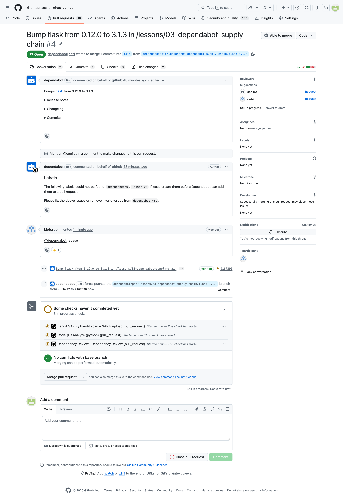
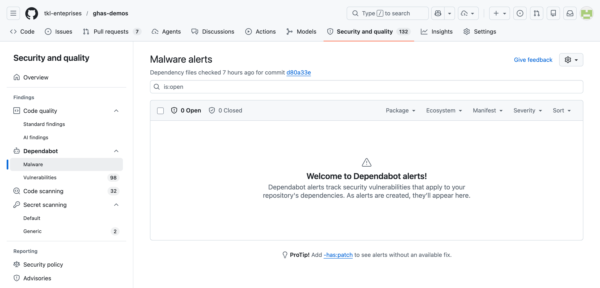

# Lesson 10 — Grouped Dependabot security updates

A facilitator-ready demo of dependency alerts, grouped Dependabot security-update pull requests, organization-level prioritization, and npm malware alerts. The Python dependencies are **intentionally vulnerable** fixtures. Do not install them, run the app, or merge Dependabot's fixes into the workshop branch.

## Goal

Experience GitHub's supply-chain stack in a real repo:

- **Dependency graph** — GitHub parses `requirements.txt` / `pyproject.toml` and lists every direct + transitive package.
- **Dependabot alerts** — reviewed advisories matched against the default-branch dependency graph.
- **Grouped security updates** — one PR can update multiple vulnerable dependencies matched by a group rule.
- **Organization security overview** — prioritize Dependabot risk across repositories.
- **Malware alerts** — an optional observation-only npm demo; no malicious package is added here.
- **Dependency review** — a PR check that blocks new vulnerable deps from sneaking in.

## Learning objectives

After this lesson you can:

- Read a Dependabot alert: advisory ID, affected range, fix availability, severity, and available context.
- Distinguish **Dependabot alerts** (signal) from **Dependabot security update PRs** (action).
- Explain and inspect a grouped security-update PR.
- Use the current organization **Security and quality → Dependabot dashboard** view.
- Explain what npm malware alerts do without downloading a malicious package.

## Estimated time

**~12 min demo + 8 min discussion**

## Prerequisites

- The configuration must be present on the repository's **default branch**.
- Enable **Dependency graph**, **Dependabot alerts**, and **Dependabot security updates** in **Settings → Advanced Security**. Group rules in `dependabot.yml` do not enable those features.
- The presenter needs write, maintain, admin, or explicitly granted alert access to inspect repository alerts. Repository settings require admin access.
- Wait for GitHub to parse the manifests and create alerts/PRs. Processing is asynchronous and cannot be guaranteed during a live session.
- For the organization view, use an organization eligible for the additional security overview views. Availability is plan-dependent: GitHub documents these views for Team organizations with GitHub Secret Protection or GitHub Code Security, and organizations owned by a GitHub Enterprise account. Organization owners and security managers can see organization-wide data; members see only repositories whose alerts they can access.
- For the optional malware view, separately enable **Dependabot malware alerts** after Dependabot alerts. Malware alerts currently support only the `npm` ecosystem.
- `.github/workflows/dependency-review.yml` is optional for this lesson's PR-prevention discussion.

## What's in this lesson

- `requirements.txt` — the canonical, pinned, intentionally-vulnerable dep list.
- `pyproject.toml` — PEP 621 mirror of the same deps for Poetry / build-system users.
- `app.py` — a tiny Flask app whose imports exercise each vulnerable package.
- `solution.md` — the operational guide (triage workflow, resolution paths, configuration tips).

> `.github/dependabot.yml` contains a `pip` group with `applies-to: security-updates` and `patterns: ["*"]`. The weekly schedule controls version-update checks; security-update PRs are driven by Dependabot alerts and fix availability, not by that weekly schedule.

## Pinned vulnerabilities

Every line in `requirements.txt` maps to at least one published advisory in the GitHub Advisory Database. Dependabot will surface them under **Security and quality → Findings → Dependabot → Vulnerabilities** once the dependency graph processes the file.

| Package      | Version | Representative advisory | Current severity | First patched | Impact summary |
|--------------|---------|-------------------------|------------------|---------------|----------------|
| Flask        | 0.12.0  | `GHSA-562c-5r94-xh97`  | High             | 0.12.3        | Denial of service via incorrectly encoded JSON data. |
| Jinja2       | 2.10    | `GHSA-462w-v97r-4m45`  | High             | 2.10.1        | Sandbox escape via `str.format` on user-controlled format strings. |
| Werkzeug     | 0.14    | `GHSA-2g68-c3qc-8985`  | High             | 3.0.3         | Debugger access and code execution after interaction with an attacker-controlled domain. |
| urllib3      | 1.24.1  | `GHSA-mh33-7rrq-662w`  | High             | 1.24.2        | Certificate validation can be bypassed in affected configurations. |
| requests     | 2.19.1  | `GHSA-x84v-xcm2-53pg`  | High             | 2.20.0        | `Authorization` header leaked on cross-origin redirects. |
| PyYAML       | 5.1     | `GHSA-8q59-q68h-6hv4`  | Critical         | 5.4           | Arbitrary code execution when loading untrusted YAML with the affected loader. |
| cryptography | 2.3     | `GHSA-hggm-jpg3-v476`  | High             | 3.2           | RSA decryption exposes a Bleichenbacher timing oracle. |

> Each exact pin and representative affected range was checked against the current GitHub Advisory Database metadata. Several pins match additional advisories, so the alert count can exceed the package count. Advisory IDs are stable identifiers — search any of them at <https://github.com/advisories>.

## Visual reference


*The Dependabot alerts page after the dependency graph parses `requirements.txt` and `pyproject.toml`. Each row maps back to a published advisory in the GitHub Advisory Database.*


*This screenshot may predate grouping. With the current configuration, eligible pip fixes matched by the group are combined when GitHub can resolve them together.*



*A single security-update PR. Note the **CVE annotation**, **release notes pulled from the upstream repo**, and the **compatibility score** — Dependabot's signal that the bump is unlikely to break callers.*

## Hands-on steps

### 1. Establish the fixture (1 minute)

Open `requirements.txt`, but **do not install it**. Point out the warning and the old exact pins. Then open the lesson's `pip` entry in `.github/dependabot.yml`:

```yaml
groups:
  lesson-ten-security-updates:
    applies-to: "security-updates"
    patterns:
      - "*"
```

Talk track: "`applies-to` is required here because groups default to version updates. The wildcard groups every eligible pip security update in this directory; it does not group npm, Actions, or another ecosystem."

### 2. Triage repository alerts (2 minutes)

1. Open the repository **Security and quality** tab.
2. Under **Findings**, expand **Dependabot**, then select **Vulnerabilities**.
3. Filter to the `pip` ecosystem or this manifest and open an alert.
4. Call out severity, affected range, patch availability, dependency scope, and the linked manifest.

Talk track: "An alert is a finding, not a PR. There can be several alerts for one dependency, and a fix PR may resolve several alerts."

### 3. Inspect the grouped security update (4 minutes)

1. Open **Pull requests** and use `is:pr author:app/dependabot label:lesson-10`.
2. Open the PR whose title or branch includes `lesson-ten-security-updates`.
3. Show that its manifest diff updates multiple dependencies, then inspect release notes, compatibility information when available, and CI.
4. Explain that the group is the review unit: one incompatible update can block the whole PR. Split or manually remediate when packages cannot safely ship together.

Do not promise an exact PR count. Dependabot groups only updates that match the rule and can be resolved together. Alerts without a patched version, conflicting constraints, already-open PRs, or temporary processing failures can remain outside the group. A group with only one eligible update still produces a one-dependency PR. Adding the rule can cause Dependabot to close superseded individual PRs and open a grouped PR.

### 4. Show organization prioritization (3 minutes)

1. Open the organization, then **Security and quality**.
2. In the sidebar, select **Dependabot**. During a staged UI rollout, the same metrics page may be labeled **Dependabot dashboard** under **Insights**.
3. Use the alert-prioritization funnel and filters such as patch availability, severity, EPSS, repository, and ecosystem.
4. Click a repository count to drill into its alerts.

Talk track: "The repository view answers 'what fixes this project?'; the organization dashboard answers 'where should we spend remediation capacity first?' Access and totals are limited to repositories whose alerts the presenter can view."

### 5. Reset (1 minute)

Do not merge the demo PR into the workshop branch. If a temporary branch or PR was created, close it and restore the branch from the default branch. Keep `requirements.txt` and `pyproject.toml` pinned so future cohorts still generate alerts.

## Dependency review on PRs

When enabled, the companion `.github/workflows/dependency-review.yml` runs on pull requests to the default branch. It uses [`actions/dependency-review-action`](https://github.com/actions/dependency-review-action) to:

- Diff the dependency graph between the base and head of the PR.
- Block (or comment) when the diff introduces a package whose version matches a published advisory.
- Optionally fail on license violations.

This is **the** safety net that stops a contributor from re-introducing a vulnerable pin that Dependabot just removed.

## Auto-merging Dependabot PRs

For low-risk patch bumps you can auto-merge once CI is green. See:

<https://docs.github.com/en/code-security/dependabot/working-with-dependabot/automating-dependabot-with-github-actions>

A common pattern: a workflow that listens for `pull_request` events from `dependabot[bot]`, reads `dependabot/fetch-metadata`, and calls `gh pr merge --auto --squash` when `update-type` is `version-update:semver-patch`.

## Optional observation: npm malware alerts

Dependabot can also alert when a dependency on the default branch matches a package marked malicious in the GitHub Advisory Database. This is a separate feature and alert stream from vulnerability alerts.



**Safe demo path**

1. Confirm **Settings → Advanced Security → Dependabot malware alerts** is enabled.
2. Open repository or organization **Security and quality → Findings → Dependabot → Malware**.
3. Show the empty state or an authorized screenshot, then discuss a public historical npm incident such as `event-stream` or `ua-parser-js`.
4. Explain the response: stop installs/builds, remove or move to a known-safe version according to the alert guidance, inspect lockfiles and build artifacts, determine whether the package executed, and rotate potentially exposed credentials.

Never add a known-malicious package, fake a public package name/version, run `npm install` against one, or generate a lockfile that references one. An empty view is the expected safe outcome for this Python fixture.

**Limitations to state aloud**

- Malware alerts currently cover only `npm`; the vulnerable Python fixture will not generate them.
- They require Dependabot alerts plus the separate malware-alert setting.
- Detection is based on the default-branch dependency graph and GitHub-reviewed malware advisories. New or unknown malware can be missed or delayed.
- Archived repositories are not scanned. A private package whose ecosystem, name, and version collide with a malicious public package can produce a false positive.
- Alert details provide remediation guidance and may identify a patched version; do not promise that GitHub will always create an automatic removal PR.

## Files

| File              | Purpose                                                          |
|-------------------|------------------------------------------------------------------|
| `requirements.txt`| Pinned, intentionally vulnerable dep list (the alert source).    |
| `pyproject.toml`  | PEP 621 mirror so Poetry / build-system tooling sees same graph. |
| `app.py`          | Tiny Flask app that imports each vulnerable package.             |
| `README.md`       | This walkthrough.                                                |
| `solution.md`     | Triage + resolution playbook for the workshop facilitator.       |

## Discussion prompts

1. When should security updates share a grouped PR, and when should they be isolated?
2. When is it acceptable to **dismiss** a Dependabot alert? What evidence should accompany an "ignore — not exploitable in our context" decision?
3. Which organization-dashboard filters best identify high-impact, actionable work?
4. Why is observing the Malware view safer than staging a real malicious dependency?

## Exit criteria

The demo has landed when:

- Attendees can distinguish an alert from a security-update PR.
- Attendees can explain `applies-to: security-updates` and identify the grouped PR.
- Attendees can navigate to the organization Dependabot view.
- Attendees understand that malware alerts are npm-only today and require no live malicious package.

## Key takeaways

- **Alerts surface risk; PRs ship the fix.** Dependabot does both, but they're separate user-visible surfaces with separate review workflows.
- Security-update groups reduce PR count but increase the blast radius of each review unit.
- Dependency review is the **prevention** half — it stops a contributor from re-introducing a vulnerable pin that Dependabot just removed.
- The schedule in `dependabot.yml` governs version-update checks, not the arrival cadence of security alerts.
- **Malware alerts are a separate, npm-only signal** and do not justify putting malware in a demo repository.

## Reset state

This lesson does not need a hard reset between cohorts—the vulnerable pins intentionally remain old.

```bash
git checkout main && git pull
```

If you opened a "test dependency review" PR during the demo, close it without merging.
