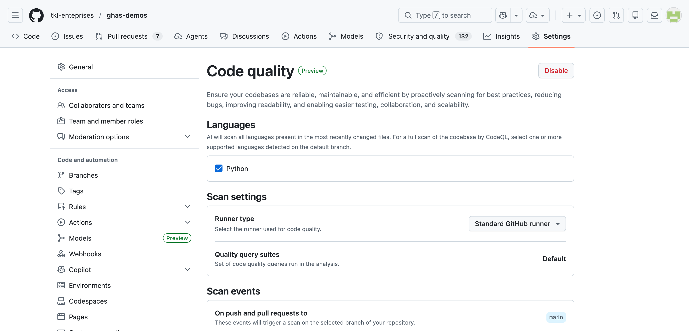
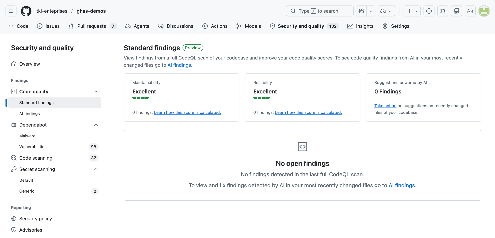
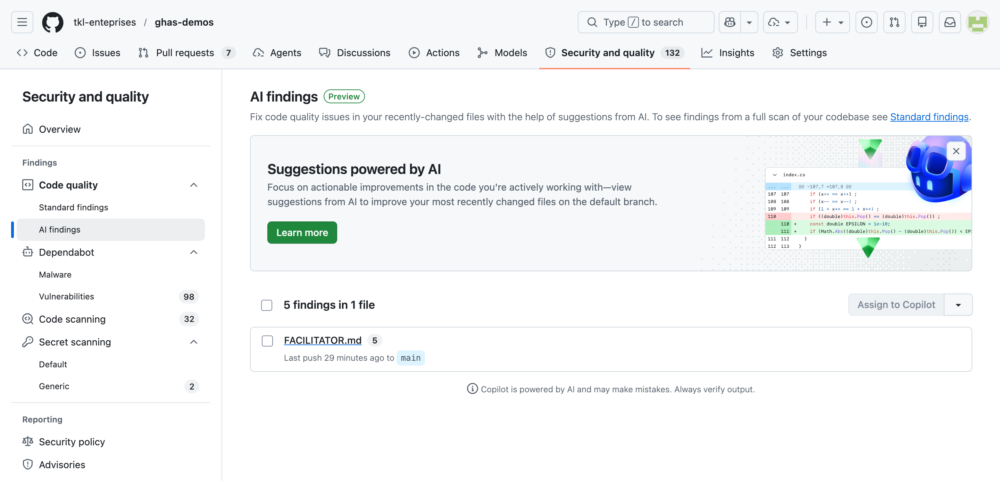
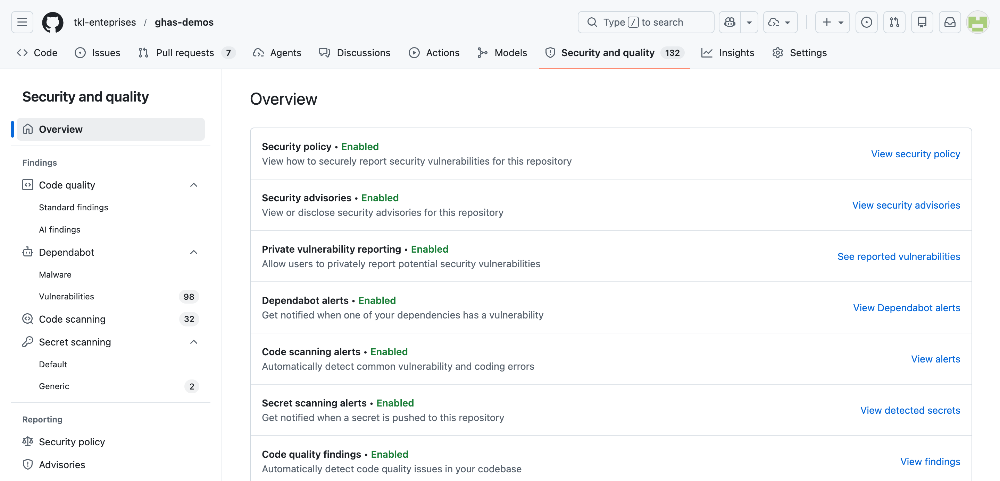

# Lesson 11 — GitHub Code Quality

> **Documentation snapshot: July 2026.** GitHub Code Quality is in public preview and is scheduled for general availability (GA) on **July 20, 2026**. GitHub's billing documentation says usage will incur charges from that date. Preview labels and UI details may change.

GitHub Code Quality is a **separate product from GitHub Code Security (formerly GitHub Advanced Security/GHAS)**. It does not require a GitHub Code Security or GitHub Copilot license. Although its rule-based analysis uses CodeQL and its pages live under **Security and quality**, do not present it as a Code Security feature or entitlement.

## Goal

Show how GitHub Code Quality detects two safe, intentional CodeQL quality defects end to end, then connect those Standard findings to remediation, AI findings, pull-request feedback, coverage, dashboards, and rulesets—while clearly separating those capabilities from Code Security.

## Learning objectives

After this lesson you can:

- Distinguish GitHub Code Quality from GitHub Code Security.
- Explain the difference between CodeQL-powered **Standard findings** and **AI findings**.
- Interpret repository reliability and maintainability ratings.
- Review PR comments, Autofix suggestions, and coverage summaries.
- Explain how quality and coverage rulesets can block a merge.
- Describe organization dashboards and the preview-to-GA billing transition.

## Estimated time

**~15 min demo + 5 min discussion**

## Prerequisites

- [Lesson 01 — CodeQL Code Scanning](../01-code-security-codeql-scanning/) provides a useful comparison, but Code Security is **not** a prerequisite or license dependency.
- GitHub's current docs list GitHub Code Quality for **organization-owned repositories** on **GitHub Team** and **GitHub Enterprise Cloud**. They do not list personal repositories, GitHub Free/Pro, or GitHub Enterprise Server as supported.
- GitHub Actions must be enabled because CodeQL quality analysis runs in a dynamic **Code Quality** workflow. A GitHub-hosted or appropriately labeled self-hosted runner can be selected.
- An enterprise owner must first allow Code Quality for an enterprise. Organization or repository settings may then control enablement, subject to higher-level enforcement.
- Rule-based CodeQL quality analysis supports C#, Go, Java, JavaScript, Python, Ruby, and TypeScript.

The lesson includes an inert JavaScript fixture and a reference remediation. Node.js is optional and is used only for local syntax and behavior checks; GitHub's dynamic Code Quality workflow performs the actual CodeQL analysis.

## Product and licensing snapshot

| Area | July 2026 documentation |
|---|---|
| Product status | Public preview; GA scheduled for July 20, 2026 |
| Plans | GitHub Team and GitHub Enterprise Cloud |
| Repository scope | Organization-owned repositories |
| Code Security/GHAS license | Not required; Code Quality is a separate product |
| Copilot license | Not required for Code Quality or its Autofix suggestions; required to delegate work to Copilot cloud agent |
| Preview billing | For private repositories, no AI-credit or active-committer charges; Actions minutes are still consumed |
| Billing from GA | GitHub documents Actions minutes, AI credits for AI-powered capabilities, and active-committer licenses as separate cost components |

The preview license estimate covers only per-committer licensing: it excludes Actions minutes, AI-credit usage, discounts, and the fact that the rolling 90-day active-committer count can change. Disable Code Quality before July 20 if the organization does not want GA charges.

## Demo assets and expected Standard findings

- [`quality-fixtures.js`](quality-fixtures.js) defines two functions but does not call them, perform I/O, access a network, or change repository state.
- [`solution.md`](solution.md) contains the reference remediation and local verification commands. Keep the defective fixture on the default branch when this repository is being used for demonstrations.

GitHub's current JavaScript Code Quality query list and CodeQL query help identify these expected results:

| Expected rule ID | Category | Severity | Precision | Intentional defect |
|---|---|---|---|---|
| [`js/template-syntax-in-string-literal`](https://codeql.github.com/codeql-query-help/javascript/js-template-syntax-in-string-literal/) | Reliability | Warning | High | Ordinary quotes leave `${userName}` uninterpreted. |
| [`js/useless-assignment-to-local`](https://codeql.github.com/codeql-query-help/javascript/js-useless-assignment-to-local/) | Maintainability | Warning | Very high | The initial `tasks.length` value is overwritten before it is read. |

These are **deterministic Standard findings** from rule-based CodeQL analysis. With these two findings alone, the expected Reliability and Maintainability ratings are both **Fair**, because Warning is the worst severity in each category. The live dashboard may contain additional findings as CodeQL rules and the rest of the repository evolve.

The fixture does **not** promise a particular **AI finding** or Autofix. AI findings analyze recently changed default-branch files and are nondeterministic; Autofix is also AI-generated and may vary or be unavailable even when the underlying Standard finding is stable.

## How analysis and results differ

### Standard findings: CodeQL rules

- CodeQL performs rule-based quality analysis on the full default branch and on pull requests targeting the default branch.
- Supported-language rules identify reliability and maintainability issues. These are quality rules, not the security query suite used by Code Security.
- Default-branch results appear under **Security and quality → Code quality → Standard findings**. Results are grouped by rule and then ordered by file path.
- Pull-request runs expose the **CodeQL - Code Quality / Analyze** check. Findings appear as comments from `github-code-quality[bot]`, labeled **Error**, **Warning**, or **Note**.
- Copilot Autofix suggestions are included where possible. GitHub does not document that every finding or rule has an Autofix.

### AI findings: recently changed default-branch files

- A separate LLM-powered pass analyzes recently pushed or merged files on the default branch.
- **AI findings** displays suggestions for up to five recently changed files. It may be empty for an inactive repository or when the analysis has no suggestions.
- This analysis is not limited to the seven CodeQL-supported languages and can identify contextual concerns for which no CodeQL rule exists.
- Users can review suggested fixes and open a PR for one file at a time without a Copilot license. Delegating one or several files to Copilot cloud agent requires a Copilot license.
- AI output can be incomplete or incorrect. Review generated changes for logic, security, and style before merging.

Do not describe AI findings as PR annotations: the documented AI pass runs after changes reach the default branch. PR quality comments come from the CodeQL rule-based scan.

## Reliability and maintainability ratings

Repository ratings summarize the **rule-based CodeQL results on the full default branch**, not AI findings or code coverage.

| Rating | Worst finding present |
|---|---|
| **Excellent** | No quality findings |
| **Good** | Note |
| **Fair** | Warning |
| **Poor** | Error |

- **Reliability** covers whether code behaves correctly and predictably, including correctness, performance, concurrency, error handling, API design, accessibility, internationalization, and security-related quality issues.
- **Maintainability** covers how easily code can be understood and changed, including best practices, dead code, duplication, complexity, logical redundancy, documentation, and dependency issues.

Ratings need context. Small repositories may look excellent because little supported code was analyzed, while generated code or repository size can lower ratings without representing the health of the maintained source.

## Walkthrough

1. **Inspect the fixture locally.** Open [`quality-fixtures.js`](quality-fixtures.js). Confirm that it is inert, then run a syntax check from this directory:

   ```bash
   node --check quality-fixtures.js
   ```

   Optionally call `buildGreeting("Ada")` in a Node REPL and observe that the returned message contains literal `${userName}`. The dead initial assignment in `countCompleted` does not change its return value.

2. **Confirm enablement.** Open repository **Settings → Code quality** and review enabled languages and the runner choice. Older preview captures may show the control under **Settings → Code security**.

   

3. **Review Standard findings and ratings.** After the default-branch Code Quality run completes, open **Security and quality → Code quality → Standard findings**. Locate the two rule IDs in the table above, expand each rule, and follow its result to `quality-fixtures.js`. With no other findings, both category cards should be **Fair**.

   The screenshot below predates the fixture and therefore shows **Excellent** ratings and no Standard findings. Use that historical state to explain why “Excellent” only meant that the scan found nothing at that time; the live fixture-backed result is the authoritative demo.

   

4. **Review AI findings separately.** Select **AI findings** and open a file if suggestions exist. The captured state showed five findings in `FACILITATOR.md`; AI results are based on recent default-branch changes, so the live list may differ or be empty. Do not use this tab to verify the two deterministic fixture findings.

   

   During a workshop, prefer reviewing the suggestion without creating a PR or assigning work. Assignment uses Copilot cloud agent, requires a Copilot license, and may consume billable AI credits after GA.

5. **Exercise remediation on a temporary branch.** Apply the two changes in [`solution.md`](solution.md), run its local verification commands, and open a PR targeting the default branch. Find **CodeQL - Code Quality / Analyze** in the checks and verify that the branch no longer contains the two fixture findings. If the fixture is first being introduced through a PR, use that introduction PR to inspect the original `github-code-quality[bot]` comments and any Autofix suggestions before applying the remediation.

6. **Contrast with Code Security.** Open **Code scanning** in the same navigation. Emphasize that both can use CodeQL and similar UI patterns, but Code Quality runs quality rules and is licensed and billed independently from GitHub Code Security.

7. **Open the organization dashboard.** Go to the organization's **Security and quality → Insights → Code quality** page. The bubble chart groups repositories by Maintainability and Reliability score; bubble position, appearance, and size show score combinations, lower-score severity, and repository count. Use the table to sort and drill into a repository. Viewers see only repositories whose quality findings they can access.

   This older preview screenshot remains useful for recognizing Code Quality in organization-level security and quality navigation, but the current documented experience is the dedicated Code Quality insights dashboard.

   

8. **Show enforcement without changing it.** Open **Settings → Rules → Rulesets** and inspect a branch ruleset:
   - **Require code quality results** blocks unresolved findings at the selected threshold: Errors, Warnings and higher, Notes and higher, or All.
   - Confirm the Code Quality check succeeds on PRs *before* activating the rule; otherwise every PR can be blocked.
   - **Restrict code coverage** can enforce a minimum aggregate coverage percentage and/or maximum allowed drop from the default branch. A threshold value of `0` disables that threshold.

Quality findings are therefore **not merely advisory** when a ruleset is active.

## Optional code coverage exercise

Code coverage is an upload-and-compare capability; Code Quality does not run the test suite for you.

1. Make the existing CI workflow run on pushes to the default branch (the baseline) and pull requests.
2. Generate a **Cobertura XML** report with the repository's existing test tool.
3. Grant the workflow only the needed permissions:

   ```yaml
   permissions:
     contents: read
     code-quality: write
   ```

4. After tests, upload the report:

   ```yaml
   - name: Upload coverage report
     if: github.event_name != 'pull_request' || github.event.pull_request.head.repo.full_name == github.repository
     uses: actions/upload-code-coverage@v1
     with:
       file: coverage.xml
       language: Python
       label: code-coverage/pytest
   ```

   The fork guard prevents an untrusted fork PR from attempting the privileged upload. Adapt the file, language, and label to the existing project; do not add a new test framework solely for this lesson.

5. On a PR, review the bot's aggregate branch-versus-default coverage and per-file deltas. GitHub stores the latest upload per branch. The summary highlights the ten most impacted files, which can include files not changed by the PR.
6. If appropriate, inspect the **Restrict code coverage** ruleset rule. This particular coverage restriction feature is itself documented as **public preview and subject to change**.

## GA, preview, and governance caveats

- The overall product is documented as public preview, with GA scheduled for July 20, 2026. “Scheduled” is deliberate: do not present a future launch as already completed.
- Organization-level repository targeting is separately labeled public preview and subject to change. It can target all repositories, selected repositories, or repositories matching visibility, fork, and custom-property filters; enforcement can prevent repository overrides.
- Coverage restriction is also separately labeled public preview and subject to change.
- Rulesets can enforce CodeQL quality severity and coverage thresholds, but the two rules are distinct.
- AI-powered capabilities can incur AI-credit charges after GA. GitHub documents purpose-built model selection and does not support customer model switching.
- Active-committer licensing uses unique committers with qualifying organization or enterprise access who pushed a commit in the rolling prior 90 days. GitHub App bots are excluded.
- Public documentation does not promise Autofix for every finding, disclose a fixed AI model, or establish support beyond the listed plans and repository scope.

## Key takeaways

- **Separate product, shared engine:** Code Quality uses CodeQL but is licensed and billed independently from Code Security.
- **Different result types:** Standard findings are rule-based; AI findings review recently changed default-branch files.
- **Enforcement is configurable:** rulesets can gate pull requests on quality severity and coverage thresholds.
- **Preview details are time-sensitive:** verify availability, billing, and UI labels before each delivery.

## Exit criteria

The demo has landed when attendees can:

- Say, “GitHub Code Quality is separate from GitHub Code Security; it uses CodeQL quality rules plus AI analysis.”
- Distinguish Standard findings, AI findings, ratings, and coverage.
- Find PR quality comments and explain when Autofix or Copilot cloud agent needs a Copilot license.
- Explain how rulesets can block on quality severity or coverage.
- State that the product is documented as preview, with GA and usage charges scheduled for July 20, 2026.

## Discussion questions

1. Which quality severity should block new PRs without making existing debt impossible to manage?
2. What does an **Excellent** rating prove, and what does it not prove for a small or partially supported repository?
3. Which repositories would you include in an organization pilot before enforcing access?
4. How should reviewers validate an Autofix or AI-generated change?
5. Would a minimum coverage percentage, a maximum coverage drop, or both best match this repository's policy?

## Reset state

Do not enable features, change rulesets, merge remediation, commit AI suggestions, or assign Copilot during a shared workshop.

If a facilitator creates a temporary remediation or coverage branch and PR, close the PR and delete only that workshop branch afterward. Leave `quality-fixtures.js` unchanged on the default branch so the two Standard findings remain available. Do not reset shared Code Quality findings or organization policy.

## Official references

- [About GitHub Code Quality](https://docs.github.com/en/code-security/code-quality/concepts/about-code-quality)
- [GitHub Code Quality billing](https://docs.github.com/en/billing/concepts/product-billing/github-code-quality)
- [CodeQL-powered analysis for Code Quality](https://docs.github.com/en/code-security/code-quality/reference/codeql-detection)
- [JavaScript CodeQL queries for Code Quality](https://docs.github.com/en/code-security/code-quality/reference/codeql-queries/javascript-queries)
- [Metrics and ratings](https://docs.github.com/en/code-security/code-quality/reference/metrics-and-ratings)
- [Fixing findings in pull requests](https://docs.github.com/en/code-security/code-quality/tutorials/fix-findings-in-prs)
- [Improving recently merged code with AI](https://docs.github.com/en/code-security/code-quality/tutorials/improve-recent-merges)
- [Setting up code coverage](https://docs.github.com/en/code-security/how-tos/maintain-quality-code/set-up-code-coverage)
- [Restricting code coverage on pull requests](https://docs.github.com/en/code-security/how-tos/maintain-quality-code/restrict-code-coverage)
- [Setting code quality thresholds](https://docs.github.com/en/code-security/code-quality/how-tos/set-pr-thresholds)
- [Exploring organization Code Quality results](https://docs.github.com/en/code-security/how-tos/view-and-interpret-data/analyze-organization-data/explore-code-quality)
